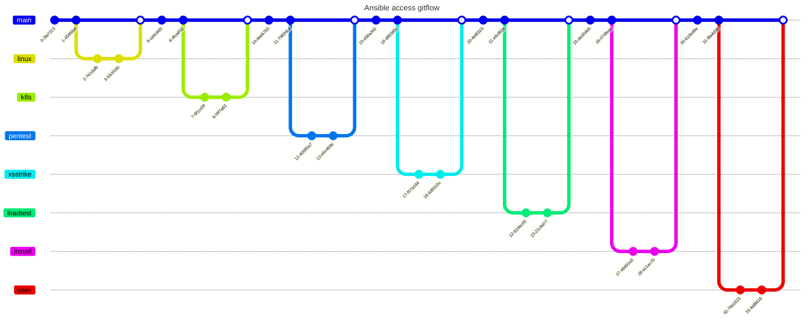

# Install software

## [Install chef](./iac/install-chef.md)

## [Install puppet](./iac/install-puppet.md)

## [Install salt-stack](./iac/install-salt-stack.md)

## [Install ansible](./iac/install-ansible.md)

# References
- ### Set up graylog https://viblo.asia/p/trien-khai-bo-luu-tru-log-tap-trung-voi-graylog-RQqKLLR4K7z

