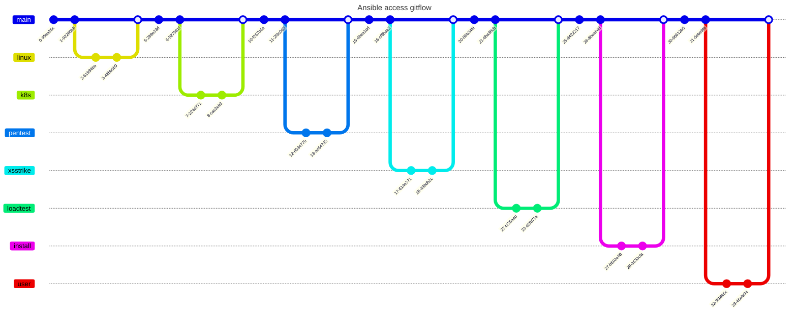

# Install software

#### How to use tmux
* Get prefix
   ```bash
   tmux show-options -g prefix
   ```
* Set prefix
   ```bash
   cat << EOF > ~/.tmux.conf
   unbind C-b
   set-option -g prefix C-a
   bind-key C-a send-prefix
   EOF
   ```
* Reload config
   ```bash
   tmux source-file ~/.tmux.conf
   ```
* Set history
   ```bash
   set -g history-limit 100000
   ```
* List pane
   ```bash
   tmux list-panes -a -F '#S:#I.#P #{pane_id}'
   ```


## [Install chef](./iac/install-chef.md)

## [Install puppet](./iac/install-puppet.md)

## [Install salt-stack](./iac/install-salt-stack.md)

## [Install ansible](./iac/install-ansible.md)

# References
- ### Set up graylog https://viblo.asia/p/trien-khai-bo-luu-tru-log-tap-trung-voi-graylog-RQqKLLR4K7z


```mermaid
---
title: Ansible access gitflow
---
gitGraph
   %%{
        init: { 
            'logLevel': 'debug', 'theme': 'default', 
            'themeVariables': {
              'commitLabelColor': '#ff0000',
              'commitLabelBackground': '#00ff00',
              'tagLabelFontSize': '16px',
              'fontSize: '146px'
            },
            'gitGraph': {
                'useMaxWidth': 'true'
            }
        }
    }%%
   commit
   commit
   branch linux
   checkout linux
   commit
   commit
   checkout main
   merge linux
   commit
   commit
   branch k8s
   checkout k8s
   commit
   commit
   checkout main
   merge k8s
   commit
   commit
   branch pentest
   checkout pentest
   commit
   commit
   checkout main
   merge pentest
   commit
   commit
   branch xsstrike
   checkout xsstrike
   commit
   commit
   checkout main
   merge xsstrike
   commit
   commit
   branch loadtest
   checkout loadtest
   commit
   commit
   checkout main
   merge loadtest
   commit
   commit
   branch install
   checkout install
   commit
   commit
   checkout main
   merge install
   commit
   commit
   branch user
   checkout user
   commit
   commit
   checkout main
   merge user
```
