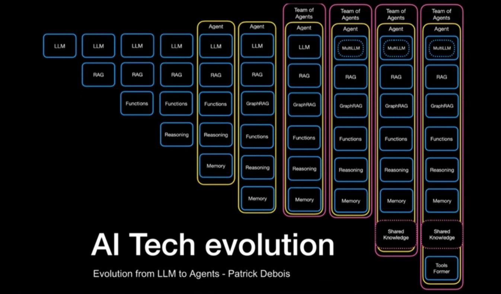

# Agent components

### `System prompts`
- #### defines their core characteristics and operational parameters
- #### establish an agent’s persistent traits, boundaries, and behavioral frameworks throughout its operational life cycle
- #### Role definition and scope of responsibilities
- #### Constraints and operational boundaries
- #### Communication protocols with other agents
- #### Decision-making frameworks specific to their role

### `Knowledge representation` 
- #### provides the mechanisms for encoding an agent’s understanding of its env into formats amenable to reasoning and decision-making processes


#### `Semantic networks` 
- #### are graph-based structures composed of nodes that represent concepts, entities, events, or states in the world


#### `Frames`
- #### knowledge about objects, situations, or events is stored in data structures
- #### Each frame consists of a collection of attribute-value pairs that describe the properties and characteristics of the concept being represented

#### `Logic-based representations`
- #### takes a more formal, mathematical route => encode facts, rules, and axioms about a domain
- #### formal logical languages such as propositional logic , rst-order logic , or specialized modal/temporal logics
```
“All humans are mortal” can be represented as ∀ x (Human(x) → Mortal(x)) in rst-order logic
“It is raining or it is sunny” can be expressed as Rain ∨ Sunny in propositional logic
“Eventually, the system will stabilize” can be modeled as ◇ Stable in temporal logic
```

#### `Deductive reasoning`

- #### is a fundamental form of logical reasoning that follows a top-down approach
- #### Applied to Mathematics/geometry, Law, Software verification, Network routing

#### `Inductive reasoning`

- #### follows a bottom-up methodology, involves making generalizations or deriving probable conclusions from a set of specific observations or data points
- #### Applied to Scientific method, ML, Pattern recognition, Data Mining, Natural language acquisition

#### `Abductive reasoning` ~ inference to the best explanation

- #### is a form of reasoning that works backward – attempting to find the most plausible explanations or premises that could account for a given set of observations or data
- #### Applied to Medical diagnosis, Fault detection, Forensics/criminal investigation, AI planning, Scienti c discovery

#### `Utility function`
- #### enable the agent to compare and choose actions that maximize expected utility


#### `Reactive agents` 
- #### Functions based on predefined rules or conditions
- #### responding to environmental triggers without any internal representation of that environment
- #### Such as chatbot generates replies based on keywords in user input
- #### Lacking memory of past interactions or the ability to learn => `effective for basic tasks`

#### `Deliberative agents` 
- #### makes decisions based on reasoning, planning, and an internal model of the world
- #### assess potential actions based on predicted outcomes

#### `Hybrid agents`
- #### It combine the strengths of both reactive and deliberative approaches, creating more robust systems


### Từ LLM đến AI agents
- #### `LLM`: Mô hình ngôn ngữ lớn như GPT, Claude, hay Gemini ở giai đoạn đầu chủ yếu thực hiện một nhiệm vụ: trả lời dựa trên văn bản được huấn luyện.
- #### `RAG (Retrieval-Augmented Generation)`: Giúp mô hình "đọc thêm" dữ liệu bên ngoài (qua tìm kiếm), mở rộng kiến thức beyond dữ liệu huấn luyện ban đầu.
- #### `Functions`: Mở ra cánh cửa cho AI hành động gọi API, thao tác dữ liệu, tự động hóa nhiệm vụ.
- #### `Reasoning`: Năng lực suy luận bắt đầu xuất hiện cho phép xử lý các yêu cầu phức tạp hơn thay vì chỉ hồi đáp bề mặt.
- #### `Memory` ~ mô hình bắt đầu "ghi nhớ" trạng thái, tiến trình và bối cảnh giữa các lần tương tác => chuyển từ "LLM" đến "AI agent" có trí nhớ, vai trò, mục tiêu và năng lực nhất định
- #### `Team of Agents` là một đội ngũ các Agent: Phối hợp, chia nhiệm vụ, đối thoại, lập kế hoạch.
- #### `GraphRAG`: Kết nối tri thức có cấu trúc giống như mạng tri thức giữa các agent.
- #### `MultiLLM`: Một Agent không chỉ dùng 1 LLM, mà có thể phối hợp nhiều LLM để tối ưu (ví dụ: Claude tư duy logic, GPT sáng tạo nội dung...).
- #### `Collective Intelligence của AI` chia sẻ tri thức với nhau qua lớp Shared Knowledge tạo nên một dạng "trí tuệ tập thể máy" -> `trở thành một hệ thống đồng đội kỹ thuật số cùng học, cùng tối ưu, cùng phát triển.`
- #### `Tools Former` cho phép Agent tự tạo công cụ phục vụ chính mình (tự lập trình, tự điều chỉnh cách làm việc).
