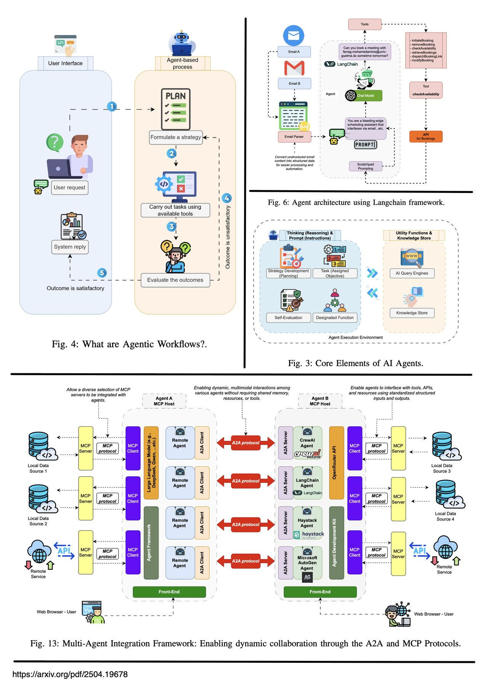
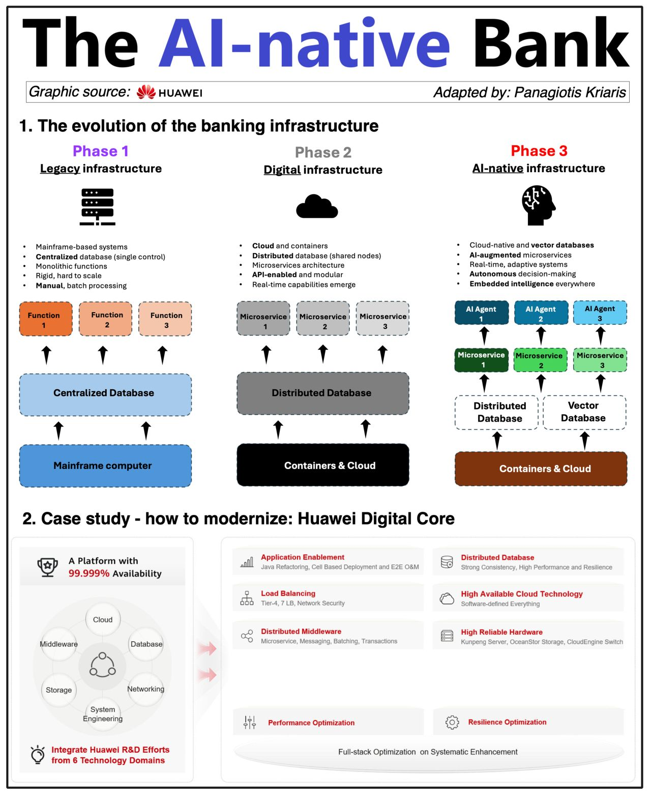
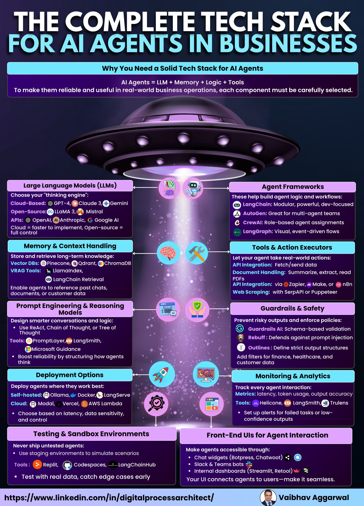

# Agentic AI stack

### Use-cases

### Bannking infra

### 🔷Knowledge Layer: 
- #### Curate & vectorize knowledge (documents, web, internal systems)

### 🔷 Tool/Retrieval Layer
- #### Gathers data from web searches, APIs, operational data, SaaS, and vector databases.
- #### Build retrievers (BM25, DPR, etc.) for precision search
- ####  Integration Layer: Plug into real-world systems (CRM, APIs)

### 🔷 Action/Orchestration Layer
- #### Manages task execution with business logic, user interactions, and task management tools
- #### Generation Layer: Feed that into an LLM (GPT, LLaMA) to generate intelligent responses

### 🔷 Reasoning Layer
- #### Utilizes contextual analysis, decision trees, and Natural Language Understanding (NLU) for informed decisions.
- #### Agentic Layer: Add an agentic layer to reason, re-query, and execute

### 🔷 Feedback/Learning Layer
- #### Incorporates user feedback, model training, performance metrics, and continuous improvement for adaptive learning.

### 🔷 Security/Compliance Layer
- #### Ensures data encryption, access control, compliance monitoring, and audit trails for secure operations.
- #### Monitoring & Guardrails: Monitor, secure, and improve continuously

### 🔷 Multi-Agent AI: Coordination & Planning Architectures
- #### Integrates with LLMs for contextual analysis and decision-making
- #### Uses persistent memory for task management and automation scripts
- #### Event logging tracks operations for insight.

### 🔷 Goals in Multi-Agent AI
- #### Supports various planning types: cooperative, competitive, mixed, hierarchical.

### 🔷 CPDE & DPDE Communication
- #### `Communication Protocol Development Environment` (CPDE) ~ A framework or platform for developing and implementing AI agent communication protocols
- #### `Distributed Peer-to-Peer Data Exchange` (DPDE) ~ A framework where AI agents exchange data directly with each other, without relying on a central authority
- #### Operates both with and without communication
- #### Utilizes shared memory for data exchange.

## Complete techincal stack for AI agent
- #### Want your AI Agent to work like a smart teammate, not just a chatbot?
- #### Then you need more than just an LLM, you need the full tech stack.
- #### From memory and logic to safety and deployment, every piece matters.
- #### `AI Agents = LLM + Memory + Logic + Tools` => help companies go from clunky operations to lean, high-output systems with AI agents, automations, and chatbots.

### Here’s what a complete AI Agent Tech Stack looks like 👇
#### 1. LLMs (Large Language Models)
- #### Your agent’s brain—choose between GPT-4, Claude 3, Gemini, or open-source like LLaMA 3 & Mistral, `qwen3`.

#### 2. Memory & Context Handling
- #### Use Pinecone, ChromaDB, or LangChain Retrieval to give your agents long-term memory.

#### 3. Prompt Engineering & Reasoning
- #### Structure agent thinking with `ReAct`, Chain-of-Thought, and tools like PromptLayer or LangSmith.

#### 4. Agent Frameworks
- #### Build workflows using `LangChain`, AutoGen, CrewAI, or `LangGraph`.

#### 5. Tools & Action Executors
- #### Connect your agent to Zapier, Make, or `n8n` for task execution. Add PDF readers, APIs, or web scraping.

#### 6. Guardrails & Safety
- #### Use Guardrails AI or Rebuff to enforce output structure, prevent hallucinations, and comply with policies.

##### 7. Monitoring & Analytics
- #### Track how well your agent is performing using Helicone, LangSmith, or `Trulens`.

#### 8. Deployment Options
- #### Cloud (Vercel, AWS Lambda) or self-hosted (Ollama, Docker)—pick based on control and speed.

#### 9. Testing & Sandbox Environments
- #### Validate with Codespaces, Replit, or LangChainHub before going live.

##### 10. Front-End UIs
- #### Make agents user-friendly via Slack, chat widgets, or Streamlit dashboards.
