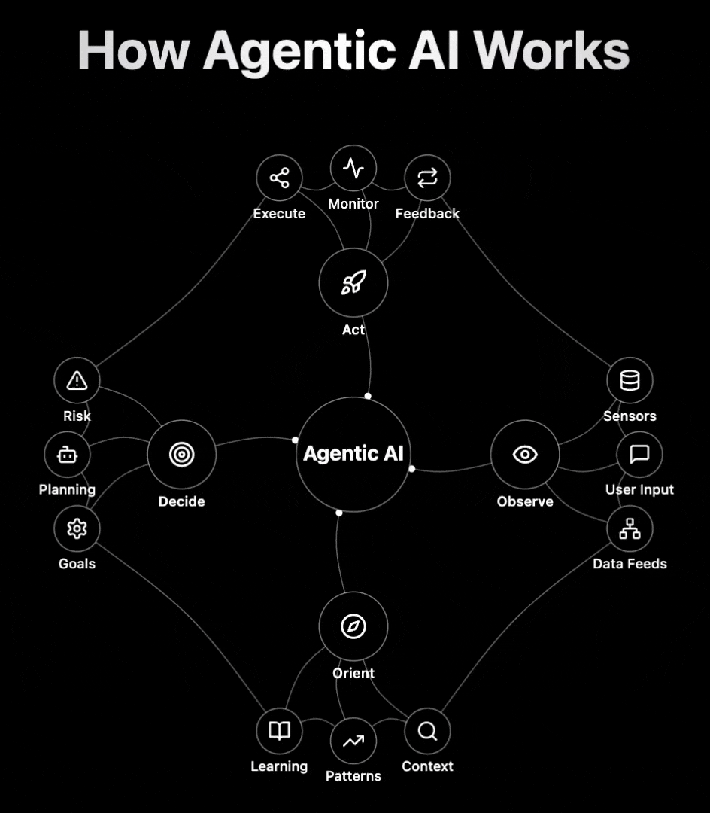

# Agentic SDLC

### 1. Problem Definition:

- AI Agent: Drafts business needs
- Human: Finalises scope and objectives, and allocates resources, ensuring alignment with business goals.

### 2. Design

- Humans: Give AI Agents the plan for their prototype in a markdown file.
- AI Agent: Outlines the project plan and drafts detailed requirements with a basic prototype.
- Human: Verifies requirements, adjusts the UI UX and validates the requirements to ensure completeness and accuracy.
- AI Agent: Creates initial design patterns.

### 3. Development:

- AI Agent: Drafts the codebase, writes unit tests, and prepares documentation.
- Human: Perform usability tests, integrates feedback and ensures code quality.

### 4. Testing:

- AI Agent: Automates unit, integration, and system tests and writes bug reports.
- Human: Validates test results, conducts manual testing, reviews bug reports, and ensures overall test coverage.

### 5. Deployment:

- AI Agent: Automates pipelines, performs post-deployment checks and ensures smooth deployment.
- Human: Supervises the deployment process, manages rollbacks if necessary, and ensures compliance.

### 6. Maintenance:

- AI Agent: Applies updates and patches and monitors system performance.
- Human: Acts upon user feedback, provides ongoing support, addresses complex issues, and plans for future enhancements.

### Consideration
- #### 1. RAG

- ### 2. AI Agent

### Từ ‘In the loop’ đến ‘On the loop’: Cách AI tái định hình vai trò của con người trong doanh nghiệp⚡️
- #### 🤖 Không còn đơn thuần là những chatbot chỉ biết phản hồi, AI Agents ngày nay đã trở thành “nhân viên số” thực thụ, có thể lập kế hoạch, thực hiện và tự điều chỉnh công việc một cách chủ động.
- #### `“Chúng ta đang bước từ kỷ nguyên "Human in the loop", nơi con người chỉ giám sát AI` => `"Human on the loop", nơi con người và AI hợp tác chủ động như những cộng sự thực thụ"`

### 📈 Trước sự phát triển mạnh mẽ của AI Agent => đề xuất chiến lược 4P để doanh nghiệp chủ động ứng dụng và triển khai hiệu quả:
- #### 🔹 `Process` - Thiết kế lại quy trình vận hành doanh nghiệp để AI Agents có thể phối hợp mượt mà với con người.
- #### 🔹 `People` - Đào tạo nhân sự để thích nghi với môi trường làm việc cùng AI.
- #### 🔹 `Platform` - Xây dựng nền tảng dữ liệu đủ mạnh để tích hợp và vận hành AI Agents.
- #### 🔹 `Product` - Tận dụng AI Agents để tạo ra sản phẩm sáng tạo và nâng cao trải nghiệm cá nhân hóa cho khách hàng

### How AI agentic works
- #### `Key phases of the OODA loop` (Observe, Orient, Decide, Act)
- #### `Supporting sub-nodes` that detail essential functions such as sensing, context analysis, planning, and feedback
- #### Most current AI systems `operate reactively, responding only when prompted and following strict, predefined patterns` => limits their ability to handle dynamic situations and truly assist in complex scenarios.
- #### `Agentic AI` implement a multi-layered architecture that enables autonomous operation, continuous learning, and ethical decision-making, allowing AI to become a proactive partner rather than just a tool.
- #### 1 - Operates on Core Principles of autonomous operation, goal-driven behavior, context awareness, and self-improvement
- #### 2 - Features an Autonomy Engine that enables self-initiated actions and resource management
- #### 3 - Uses Adaptive Learning to continuously evolve through reinforcement learning and pattern recognition
- #### 4 - Incorporates a Decision Matrix for real-time risk assessment and scenario simulation
- #### 5 - Maintains ethical boundaries through a dedicated Governance layer
- #### 6 - Integrates with other AI agents through a collaborative ecosystem
- #### 7 - Represents the next evolution in AI, moving from reactive to proactive intelligence