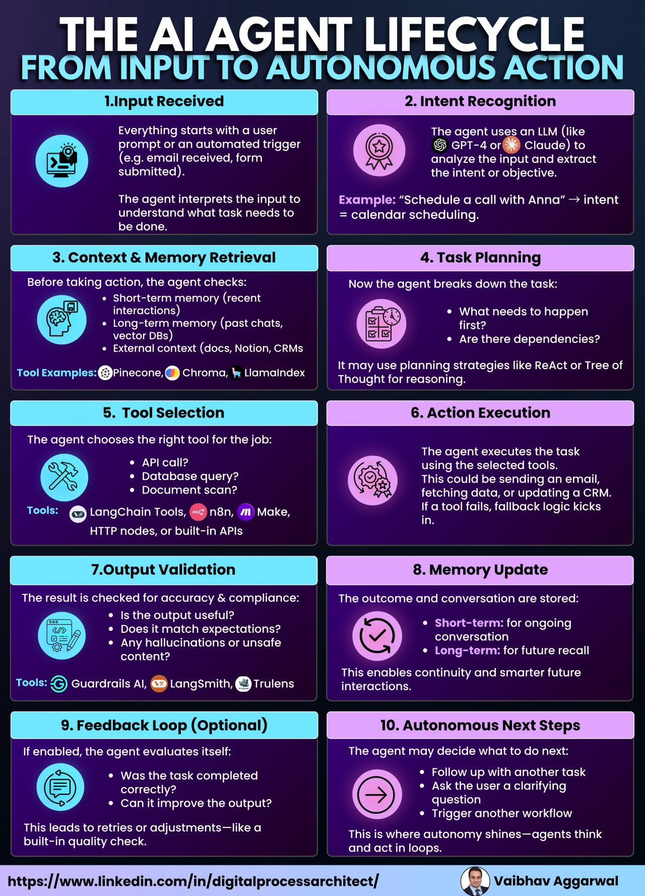
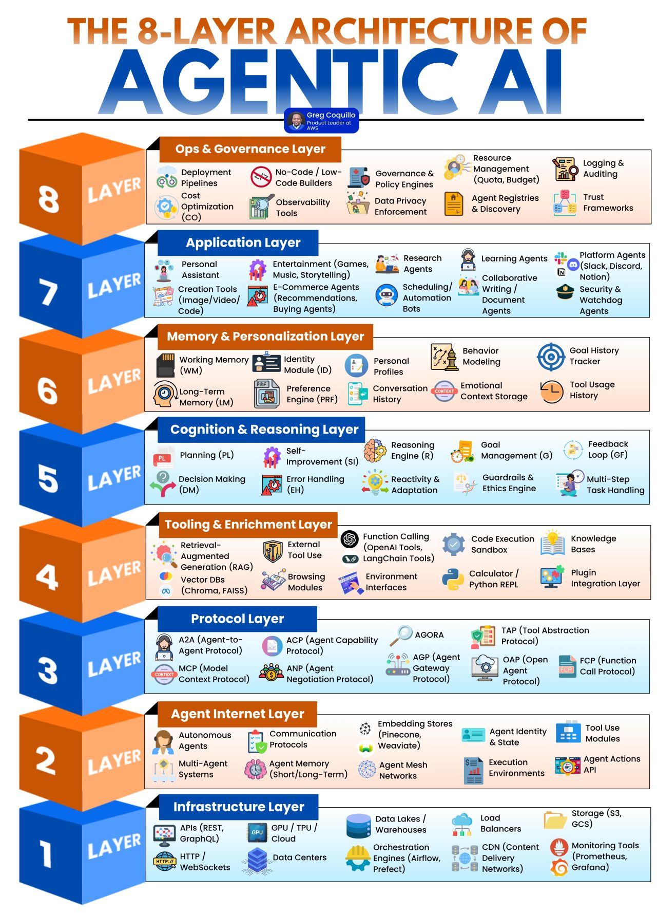

# AI agent life cycle
```
dữ liệu phân tán, thông tin phân phối, tri trức tập trung, hành động nhất quán
```



#### 1. Input Received
- #### A user prompt or trigger starts it all. The agent identifies what needs to be done.

#### 2. Intent Recognition
- #### LLMs like GPT-4 or Claude analyze the input to extract user intent or goal.

#### 3. Context & Memory Retrieval
- #### The agent pulls from short-term, long-term, and external memory before taking any action.

#### 4. Task Planning
- #### Breaks down the task into steps, resolves dependencies using reasoning frameworks like ReAct or Tree of Thought.

#### 5. Tool Selection
- #### Chooses the best tool for the job - API call, database query, or external service.

#### 6. Action Execution
- #### Executes the task through the selected tools and handles fallbacks if something fails.

#### 7. Output Validation
- #### Validates output for usefulness, safety, and hallucination with tools like Guardrails and LangSmith.

#### 8. Memory Update
- #### Updates memory to keep continuity and support future decision-making.

#### 9. Feedback Loop (Optional)
- #### Evaluates its own performance - adjusts output or retries if quality is off.

#### 10. Autonomous Next Steps
- #### Decides what to do next: follow up, ask questions, or run another workflow.

### 𝗔𝗴𝗲𝗻𝘁𝗶𝗰 𝗔𝗜 𝗟𝗶𝗳𝗲𝗰𝘆𝗰𝗹𝗲: 5 𝗦𝘁𝗮𝗴𝗲𝘀 𝗬𝗼𝘂 𝗖𝗮𝗻’𝘁 𝗜𝗴𝗻𝗼𝗿𝗲

### 1. `𝗦𝗰𝗼𝗽𝗲`: 𝗗𝗲𝗳𝗶𝗻𝗲 𝗬𝗼𝘂𝗿 𝗨𝘀𝗲-𝗖𝗮𝘀𝗲 𝘄𝗶𝘁𝗵 𝗥𝗢𝗜
- #### Before writing a single line of code, clarify problem. Understand the business impact, data needs, and set measurable goals. Without this, your AI agent is just guesswork.

### 2. `𝗦𝗲𝗹𝗲𝗰𝘁`: 𝗨𝘀𝗲 𝗮 𝗠𝗮𝗿𝗸𝗲𝘁𝗽𝗹𝗮𝗰𝗲 𝗼𝗳 𝗠𝗼𝗱𝗲𝗹𝘀, 𝗔𝗴𝗲𝗻𝘁𝘀 & 𝗧𝗼𝗼𝗹𝘀
- #### Building everything from scratch? That’s a recipe for disaster. Use trusted reasoning models (LLMs), agents, and tools from marketplaces. This is your AI toolbox — don’t reinvent it.

### 3. `𝗔𝗴𝗲𝗻𝘁 𝗗𝗲𝘃𝗲𝗹𝗼𝗽𝗺𝗲𝗻𝘁`: 𝗗𝗲𝘀𝗶𝗴𝗻 𝘄𝗶𝘁𝗵 𝗖𝗹𝗲𝗮𝗿 𝗟𝗼𝗴𝗶𝗰
- #### `𝘋𝘦𝘵𝘦𝘳𝘮𝘪𝘯𝘪𝘴𝘵𝘪𝘤 𝘈𝘨𝘦𝘯𝘵𝘴`: Pre-plan every step with fixed agents and tools—ideal for predictable tasks.
- #### `𝘈𝘶𝘵𝘰𝘯𝘰𝘮𝘰𝘶𝘴 𝘈𝘨𝘦𝘯𝘵𝘴`: Set the goal, then let the agent adapt dynamically using reinforcement learning. More complex, but flexible

### 4. `𝗢𝗽𝘁𝗶𝗺𝗶𝘇𝗲 𝗗𝗲𝗽𝗹𝗼𝘆𝗺𝗲𝗻𝘁 & 𝗜𝗻𝗳𝗲𝗿𝗲𝗻𝗰𝗲`
- #### Efficient deployment matters. Whether it’s quantizing models or deploying on edge devices, optimizing costs and power is crucial as you scale.

### 5. `𝗚𝗼𝘃𝗲𝗿𝗻𝗮𝗻𝗰𝗲 & 𝗘𝘃𝗮𝗹𝘂𝗮𝘁𝗶𝗼𝗻`: 𝗧𝗵𝗲 𝗨𝗹𝘁𝗶𝗺𝗮𝘁𝗲 𝗦𝗮𝗳𝗲𝗴𝘂𝗮𝗿𝗱
- #### Responsible AI isn’t optional—it’s mandatory. Implement security, guardrails, observability, and human oversight. Combine automated judges with manual reviews to ensure safety, accuracy, and compliance.


### Agentic AI layer
#### 1️⃣ Infrastructure Layer:
- #### Foundational components that include APIs, cloud infrastructure, data storage, and orchestration systems that support reliable operations.

#### 2️⃣ Agent Internet Layer:
- #### Enables communication and coordination between distributed components.It supports protocols, memory modules, and shared data networks.

#### 3️⃣ Protocol Layer:
- #### This layer defines standard communication methods for agents, capabilities, and task execution across tools and platforms.

#### 4️⃣ Tooling and Enrichment Layer:
- #### Provides access to external tools, retrieval systems, code execution environments, and other utility modules for task completion.

#### 5️⃣ Cognition and Reasoning Layer:
- #### Manages decision-making, planning, error handling, and feedback. It enables systems to adapt and improve based on results.

#### 6️⃣ Memory and Personalization Layer:
- #### Maintains short-term and long-term memory, user preferences, identities, and behavioral patterns to support contextual responses.

#### 7️⃣ Application Layer:
- #### Interfaces that users interact with, including assistants, content generators, research tools, and collaborative agents.

#### 8️⃣ Operations and Governance Layer:
- #### Focuses on system reliability, observability, compliance, and cost optimization. Provides governance frameworks and oversight tools.

#### `Learning layer` ~ Data Centralized – Dữ liệu tập trung là nền tảng
- #### Dữ liệu được thu thập chuẩn hóa trong một hạ tầng chung
- #### Được làm sạch, phân loại, và gắn quyền truy cập
- #### `Càng tập trung bao nhiêu => AI càng dễ huấn luyện và kiểm soát bấy nhiêu`

#### `Build layer` ~ Nơi huấn luyện, triển khai, và duy trì AI
- #### `Infra for AI – Hạ tầng AI`: Máy chủ, GPU, ... – chính là nơi “AI được nuôi dưỡng”.
- #### `AI Platform – Nền tảng AI`: IDP giúp thao tác để tạo mô hình, fine-tune, quản lý vòng đời AI (AI lifecycle management)
- #### `Built AI`: là AI do doanh nghiệp tự huấn luyện, kiểm soát toàn bộ
- #### `Blended AI` là sự kết hợp AI nội bộ với AI providers (như GPT, Claude) => tận dụng sức mạnh từ nhiều nguồn

#### `Trust Layer`: Nơi quản trị niềm tin, rủi ro và bảo mật
* `AI không thể triển khai nếu không có Trust - niềm tin`
- #### `Tech-driven`: Có framework để kiểm soát rõ ràng:
    - #### Quản lý rủi ro   
    - #### Giám sát bảo mật
    - #### Đánh giá đạo đức AI

- #### `Human-governed`: Do con người điều phối, với 3 thành phần chính:
    - #### `Central AI Committee`: Nhóm điều phối toàn chiến lược AI
    - #### `Communities of Practice`: Các nhóm chuyên môn AI theo chức năng (VD: AI trong tài chính, AI trong vận hành)
    - #### `Back Office & Front Office`: Phân quyền rõ AI dùng cho nội bộ hay tiếp xúc người dùng

#### `Run layer`: Giai đoạn triển khai AI đi vào thực chiến
- #### `Bring-your-own AI`: Cho phép các phòng ban đem mô hình AI của riêng họ vào dùng (VD: marketing dùng ChatGPT, vận hành dùng Whisper).
- #### `Embedded AI`: AI được nhúng sẵn trong quy trình, phần mềm, nền tảng – tự động hóa không cần gọi tên AI.
- #### Mức độ decentralization càng cao thì AI càng gần với người dùng cuối, càng linh hoạt và dễ lan tỏa.

#### `Adaption layer` ~ “Data everywhere and every kind” – Dữ liệu phân tán khắp nơi
- #### `Đây là thế giới thực`: dữ liệu đang văng vãi ở mọi nơi – trên cloud, trong file Excel, trong hệ thống CRM cũ kỹ. Nhưng thay vì cố gắng kiểm soát tất cả, chúng ta cần cách quản trị phân tán và thiết kế mô hình AI đủ thông minh để hoạt động tốt với môi trường dữ liệu hỗn hợp.
- #### `Triển khai AI không phải là mua công cụ`, mà là xây một chiếc bánh sandwich hoàn chỉnh: nếu thiếu một lớp, mọi thứ có thể sụp đổ

#### AI agent lifecycle effort


Gôm 2 phase:
* "Cool Demo" Phase
* "Actual Value" Phase
