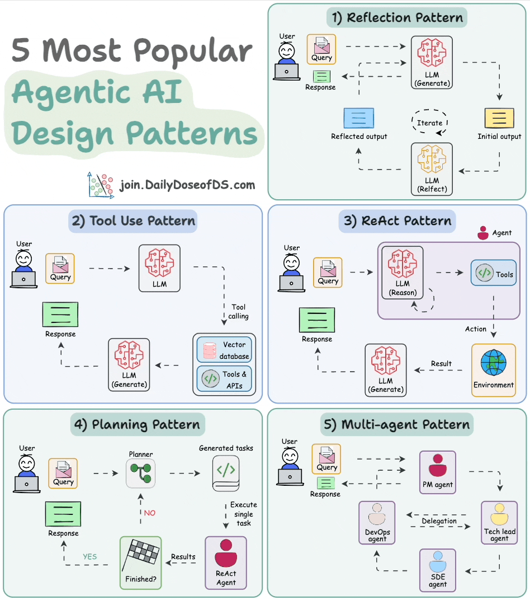

# AI agent pattterns

### Reflection Pattern
- #### AI “reviews” its own work—spotting mistakes and iterating until the final outcome is polished.
- #### Think of it like a self-critique cycle where the model refines each draft before presenting the result!

### Tool Use Pattern
- #### `Tool use agent as a person`, with the LLM as its brain and a set of tools as its hands to take actions
- #### By querying databases, calling APIs, and executing Python scripts, the LLM moves beyond relying solely on its internal knowledge.

### ReAct (Reasoning and Acting)
- #### It combines `Reflection and Tool use patterns`

### Planning Pattern
- #### About task breakdown & strategic thinking
- #### For example, subdivides tasks, outlines objectives
- #### Just like a project manager organizing a complex workflow

### Multi-Agnet Pattern
- #### Multiple specialized agents working together—each with its own role!
- 
