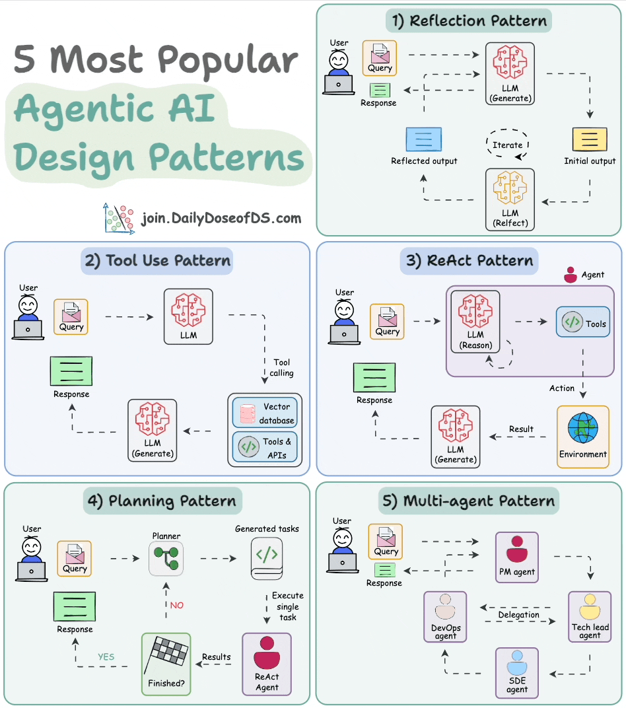
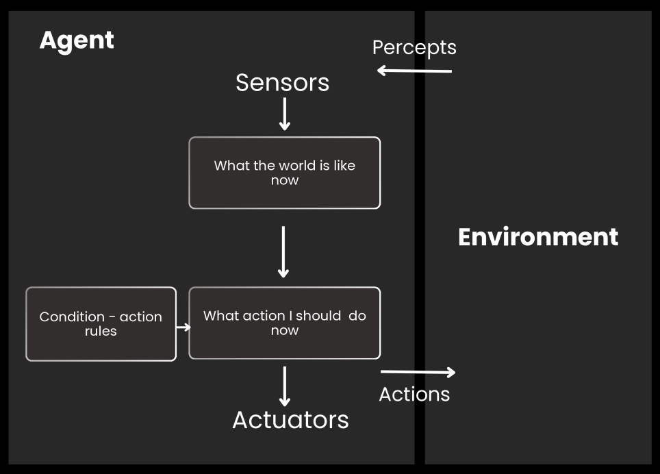
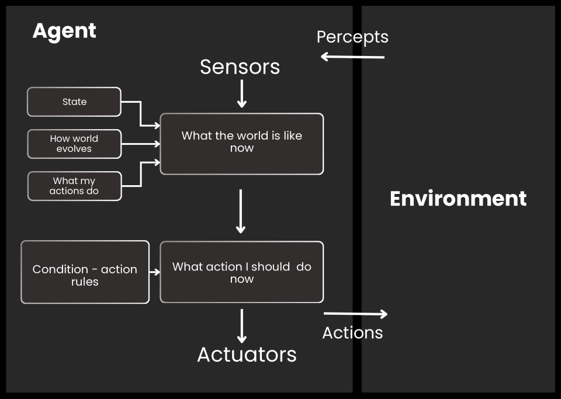
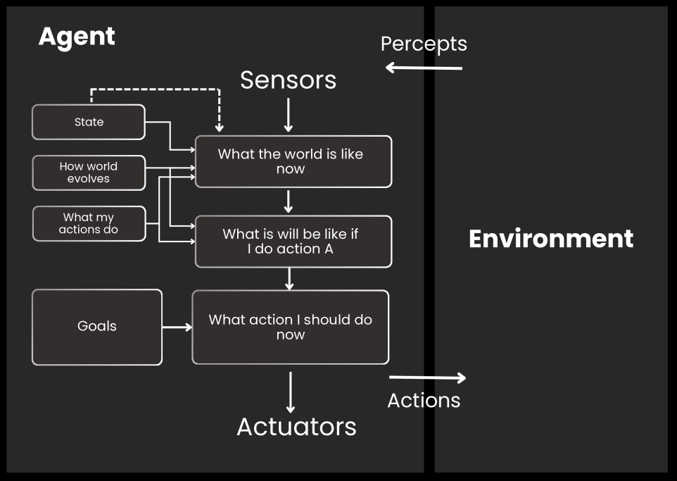
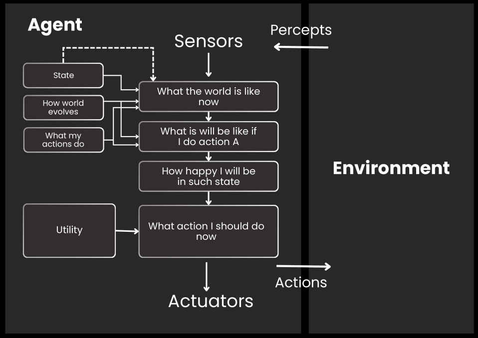
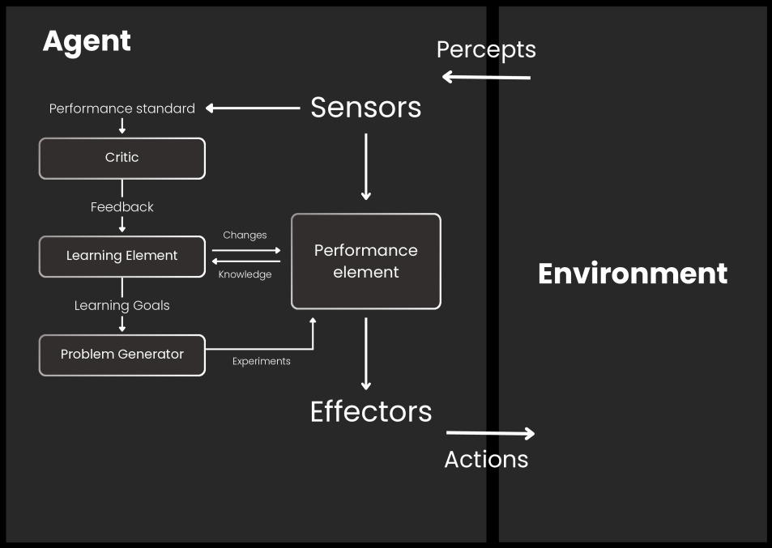
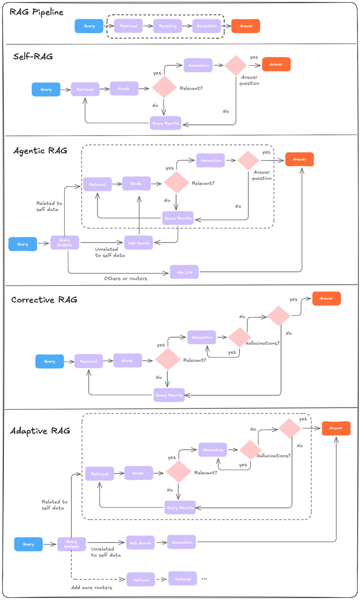
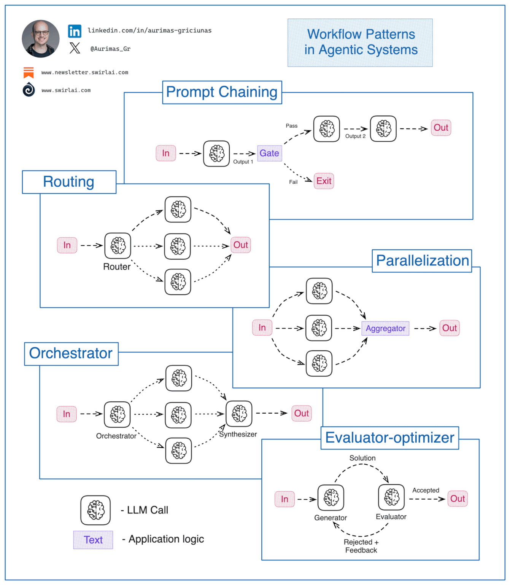

# AI agent pattterns

### Reflection Pattern
- #### AI `reviews` & `critiques` its own work—spotting mistakes and iterating until the answer is “good enough”
- #### Think of it like a self-critique cycle where the model refines each draft before presenting the result!
- #### Usecase: `LLM-as-a-Judge` ~ One LLM generates an answer, another evaluates it for refining and enhancing the quality of outputs

- #### `Simple reflex agent` 
    - #### It follow pre-defined rules to make decisions
    - #### It only responds to the current situation without considering the past or future ramifications

- #### `Model-based reflex agent`
    - #### It performs actions based on a current percept and an internal state representing the unobservable world

- #### `Goal-based reflex agent`
    - #### Using info from their env to archieve specific goals
    - #### Using search algorithms to find the most efficient path towards their objectives within a given env

- #### `Utility-based reflex agent`
    - #### It makes decisions based on maximising a utility function or value
    - #### Choosing the action with the highest expected utility, which measures how good the outcome is

- #### `Learning agent`
    - #### Learn from past experiences and improve its performance 
    - #### It initially acts with basic knowledge and adapts automatically through machine learning

### Tool Use Pattern
- #### Leverage tools (APIs, databases, websites) to enhance capabilities
- #### `Tool use agent as a person`, with the LLM as its brain and a set of tools as its hands to take actions
- #### By querying databases, calling APIs, and executing Python scripts, the LLM moves beyond relying solely on its internal knowledge
- #### `Via MCP server` makes tool use structured and scalable

### ReAct (Reasoning and Acting)
- #### It combines `Reflection and Tool use patterns`
- #### `Using with RAG` => retrieval tasks based on internal knowledge base

### Planning Pattern
- #### About task breakdown & strategic thinking
- #### For example, subdivides tasks, outlines objectives
- #### Just like a project manager organizing a complex workflow

### Multi-Agnet Pattern
- #### Multiple specialized agents working together—each with its own role!

### `Deterministic Flows`
- #### Break tasks into smaller steps
- #### Each task can be performed by an agent
- #### One agent’s output becomes the input for the next
- #### Useful for predictable, linear tasks where each step is clearly defined
- #### `Final agent` provides the final answer

### `Handoffs and Routing`
- #### Specialized sub-agents handle specific tasks
- #### Use handoffs to route tasks to the appropriate agent
- #### Support for peer-to-peer (`one agent to another`), leader-follower (One agent is responsible of routing tasks to the appropriate agent), or hierarchical routing

### `Parallelization`
- #### Run independent agents simultaneously for speed and robustness
- #### Useful for cross-verifying results with different LLMs
- #### Great for scenarios needing speed or redundancy

### `Guardrails`
- #### Ensure inputs and outputs of each agent are valid and safe
- #### Especially important when agents handle sensitive or confidential information
- #### Prevents errors or harmful outputs from propagating through your workflow

### Common patterns
#### `ReAct`: The core pattern powering agents
- #### Though, Act, Observation
- #### Planning, Validating, Executing
- #### One-shot query planning vs. Dynamic Planning

#### `Workflows` (predefined code paths)
- #### Prompt Chaining
- #### Parallelization

#### `Semi-workflows` (LLM controls predefined control paths)
- #### Orchestrator-worker
- #### Evaluator optimizer pattern
- #### Routing
- #### Reflection

#### `Pure agentic` (full flexibility)

#### `Multi-Agents Architectures`
- #### Network (or Swarm)
- #### Supervisor
- #### Supervisor (with tool-calling)
- #### Hierarchical
- #### Custom multi-agent workflow

### System Design & LLMOps
#### `Observability`
- #### Prompt Monitoring
- #### Prompt Versioning
- #### User Feedback
- #### LLM Evaluation
#### `Serving` ~ Deployment architectures (batch, realtime, async)
#### `Web Servers` (e.g., FastAPI)
#### Infrastructure scaling
#### Inference optimization
#### Cloud Infrastructure
- #### AWS Cloud Architecture
- #### IaC + CI/CD
- #### Docker
- #### CI/CD/CT
- #### IaC
#### `MCP` && `A2A`
#### Model Gateway + Guardrails + Prompt Caching