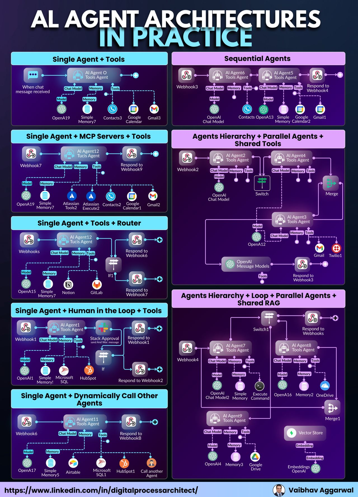

# AI agentic

- #### `Decision-making` and `planning` are critical capabilities for intelligent agents to achieve their goals effectively
- #### Agents need to analyze various possible scenarios, evaluate outcomes, and select the action(s) that will lead to the most desirable outcome based on their preferences and constraints
- #### understanding the need for `controls and guardrails` on autonomous agents and using control barrier functions
- #### `Self-governance` implies that the system can make its own decisions, set its own goals, and regulate its behavior based on its internal rules, models, and decision-making algorithms
- #### `Self-organization` : the ability to organize and structure its own internal processes, resources, and behavior without external intervention
- #### `Self-regulation` : the capability to monitor and adjust its own actions and outputs based on feedback from the environment or internal states, to ensure it operates within desired parameters or constrainvts
- #### `Self-adaptation` : the ability to modify its behavior, strategies, or decision-making processes in response to changes in the environment or its own internal conditions, to achieve its goals more effectively
- #### `Self-optimization` : the ability to continuously improve its performance, efficiency, or decision-making capabilities through learning, experience, or evolutionary processes
- #### `Self-determination` : the ability to set its own objectives, priorities, and courses of action based on its internal decision-making processes, without being entirely controlled by external forces


#### MCP framework
- #### Build effective agents with Model ContextProtocol
- #### AugmentedLLM
```python
from mcp_agent.agents.agent import Agent
from mcp_agent.workflows.llm.augmented_llm_anthropic import AnthropicAugmentedLLM

finder_agent = Agent(
  name="finder",
  instruction="You are an agent with filesystem + fetch access. Return the requested file or URL contents.",
  server_names=["fetch", "filesystem"],
)

async with finder_agent:
  llm = await finder_agent.attach_llm(AnthropicAugmentedLLM)
  result = await llm.generate_str(
    message="Print the first 2 paragraphs of https://www.anthropic.com/research/building-effective-agents",
    # Can override model, tokens and other defaults
  )

  logger.info(f"Result: {result}")

  # Multi-turn conversation
  result = await llm.generate_str(
    message="Summarize those paragraphs in a 128 character tweet",
  )
  logger.info(f"Result: {result}")
```

#### `Behavior trees`

- #### are a long-established pattern used to control robotics and AI in games
- #### Built-in node

- #### Python library: `py_trees`
- #### `Agentic behavior trees (ABTs)` implement behavior trees on assistant and agent systems

### AI agent fails
- #### `Too broad` ~ companies expect agents to solve open-closed tasks
- #### `Old playbooks` ~ try to test AI like regular software (`It doesn't work`)
- #### `Change resistance` ~ team give up when agents need training not just coding
- #### `Wrong processes` ~ traditional IT processes don't fit non-deterministic AI behaviour

### Solutions
- #### Because blaming the tech is easier than admitting we need a new way of working.
- #### `THE WINNERS ADAPT`. The rest quit
- #### Real-world benchmark
  - #### 75% end-to-end automation
  - #### 40-60% faster call resolutions
  - #### 6-point boost in customer satisfaction scores
- #### Rethink `how work gets done`
  - #### How to use tools (database, APIs, scripts, ...)
  - #### How remember context such as shor-long terms
  - #### How to adapt through feedback loops 
  - #### How to plan and execute multi-step workflows
  - #### How to follow business logic and guardrails

### How to build `AI agent`
- #### `Decomposing tasks`: Breaking big goals into small, logical steps
- #### `Managing memory`: Keeping workflows coherent over time
- #### `Catching hallucinations`: Making sure agents fact-check themselves
- #### `Scaling efficiently`: Keeping costs down while complexity rises


## AI agent architecture

- #### They're managing workflows, coordinating tools, triggering routers, and dynamically calling other agents
- #### Some setups remove entire departments of repetitive work
#### Refs:
- #### https://www.linkedin.com/pulse/4-main-ai-agent-design-patterns-recommend-andrew-ng-yiman-huang-nwype/
