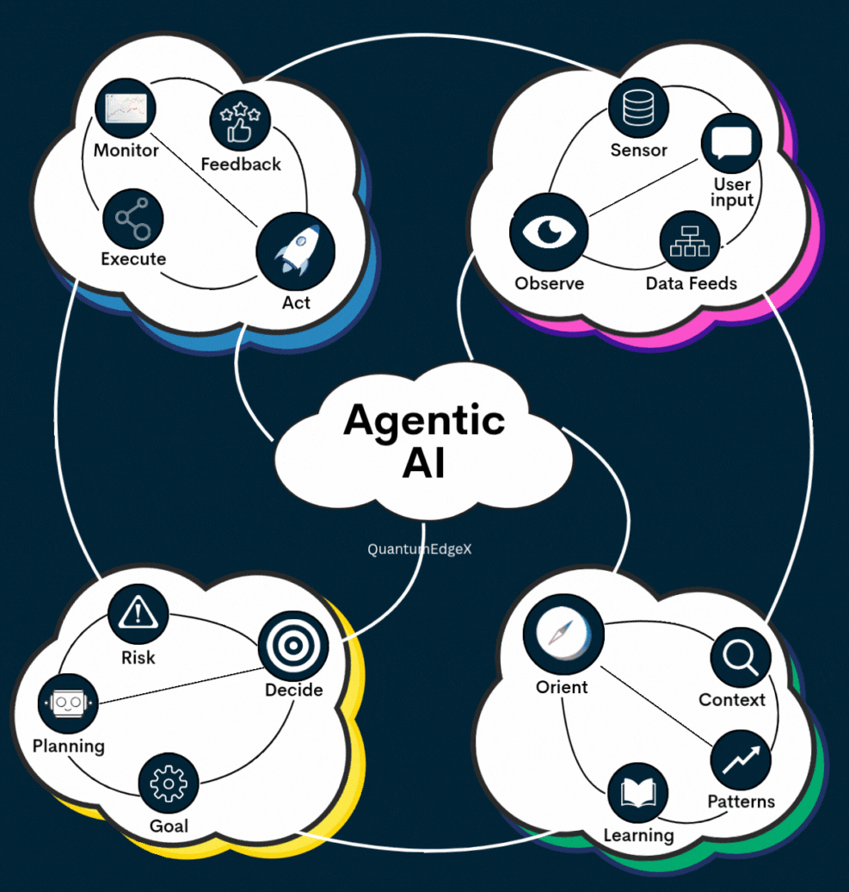

# AI agentic



* **Ra quyết định và lập kế hoạch**: phân tích nhiều kịch bản, đánh giá kết quả và chọn hành động tốt nhất dựa trên các ưu tiên và giới hạn được đặt ra
* **Tự quản lý và kiểm soát**:
    * **Tự quản lý (Self-governance)**: tự đưa ra quyết định, đặt mục tiêu và điều chỉnh hành vi của mình dựa trên các quy tắc nội bộ
    * **Tự điều chỉnh (Self-regulation)**: theo dõi và tự điều chỉnh hành động để đảm bảo hoạt động trong các giới hạn mong muốn, dựa trên phản hồi từ môi trường hoặc trạng thái bên trong
    * **Tự tổ chức (Self-organization)**: Khả năng tự sắp xếp và cấu trúc các quy trình, tài nguyên nội bộ mà không cần sự can thiệp từ bên ngoài.
    * **Tự thích nghi (Self-adaptation)**: Khả năng thay đổi hành vi và chiến lược để phản ứng với những thay đổi của môi trường.
    * **Tự tối ưu hóa (Self-optimization)**: Khả năng liên tục cải thiện hiệu suất, hiệu quả thông qua quá trình học hỏi và kinh nghiệm.
    * **Tự quyết (Self-determination)**: Khả năng tự đặt ra mục tiêu và ưu tiên hành động mà không bị kiểm soát hoàn toàn bởi các yếu tố bên ngoài.

* Giám sát và giới hạn (controls and guardrails) đảm bảo AI agent hoạt động an toàn và hiệu quả, tránh những hành vi không mong muốn


#### MCP framework
- #### Build effective agents with Model ContextProtocol
- #### AugmentedLLM
```python
from mcp_agent.agents.agent import Agent
from mcp_agent.workflows.llm.augmented_llm_anthropic import AnthropicAugmentedLLM

finder_agent = Agent(
  name="finder",
  instruction="You are an agent with filesystem + fetch access. Return the requested file or URL contents.",
  server_names=["fetch", "filesystem"],
)

async with finder_agent:
  llm = await finder_agent.attach_llm(AnthropicAugmentedLLM)
  result = await llm.generate_str(
    message="Print the first 2 paragraphs of https://www.anthropic.com/research/building-effective-agents",
    # Can override model, tokens and other defaults
  )

  logger.info(f"Result: {result}")

  # Multi-turn conversation
  result = await llm.generate_str(
    message="Summarize those paragraphs in a 128 character tweet",
  )
  logger.info(f"Result: {result}")
```

#### `Behavior trees`

- #### are a long-established pattern used to control robotics and AI in games
- #### Built-in node

- #### Python library: `py_trees`
- #### `Agentic behavior trees (ABTs)` implement behavior trees on assistant and agent systems

### AI agent fails
- #### `Too broad` ~ companies expect agents to solve open-closed tasks
- #### `Old playbooks` ~ try to test AI like regular software (`It doesn't work`)
- #### `Change resistance` ~ team give up when agents need training not just coding
- #### `Wrong processes` ~ traditional IT processes don't fit non-deterministic AI behaviour

### Solutions
- #### Because blaming the tech is easier than admitting we need a new way of working.
- #### `THE WINNERS ADAPT`. The rest quit
- #### Real-world benchmark
  - #### 75% end-to-end automation
  - #### 40-60% faster call resolutions
  - #### 6-point boost in customer satisfaction scores
- #### Rethink `how work gets done`
  - #### How to use tools (database, APIs, scripts, ...)
  - #### How remember context such as shor-long terms
  - #### How to adapt through feedback loops 
  - #### How to plan and execute multi-step workflows
  - #### How to follow business logic and guardrails

### How to build `AI agent`
- #### `Decomposing tasks`: Breaking big goals into small, logical steps
- #### `Managing memory`: Keeping workflows coherent over time
- #### `Catching hallucinations`: Making sure agents fact-check themselves
- #### `Scaling efficiently`: Keeping costs down while complexity rises


## AI agent architecture

- #### They're managing workflows, coordinating tools, triggering routers, and dynamically calling other agents
- #### Some setups remove entire departments of repetitive work
#### Refs:
- #### https://www.linkedin.com/pulse/4-main-ai-agent-design-patterns-recommend-andrew-ng-yiman-huang-nwype/
