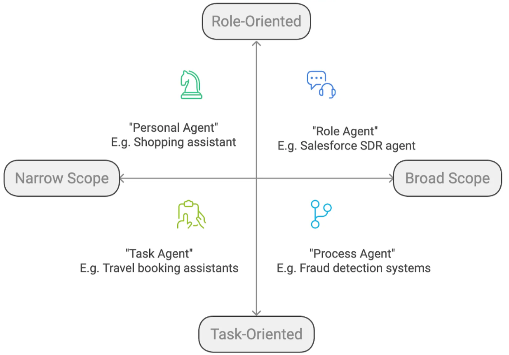

# AI agent
- #### Executes workflows on behalf of users
- #### Empowered by LLM and external tools
- #### Able to autonomously make and refine decisions
- #### Resolving complex decision-making 
- #### Handling of unstructured data sources

## 🚀 Muốn Xây Dựng AI Agent Thông Minh Hơn?
### 1. 🛠️ **Ưu Tiên Xây Dựng Công Cụ Trước**

**Thiết kế, viết code và kiểm thử công cụ thật kỹ trước khi kết nối với AI.**

> Công cụ là phần **ổn định và dễ kiểm soát nhất** trong hệ thống. Nếu nó không hoạt động tốt, agent cũng không thể hoạt động tốt.

---

### 2. 🧱 **Bắt Đầu Với Công Cụ Đơn Giản**

**Xây dựng một vài công cụ nền tảng, đa năng trước.**

> Đừng phức tạp hóa mọi thứ bằng việc tạo ra quá nhiều công cụ ngay từ đầu. Ít nhưng chất lượng sẽ dễ kiểm soát hơn.

---

### 3. 🧑‍💻 **Khởi Đầu Với Một Agent Duy Nhất**

**Sau khi có công cụ cốt lõi, hãy thử nghiệm với một agent đơn.**

> Cách này giúp bạn dễ dàng phát hiện lỗi, tinh chỉnh và tối ưu hệ thống trước khi mở rộng sang nhiều agent hay quy trình phức tạp hơn.

---

### 4. 🧠 **Dùng Mô Hình AI Tốt Nhất Ngay Từ Đầu**

**Hãy bắt đầu bằng mô hình mạnh nhất (như Claude Sonnet hoặc GPT-4).**

> Tránh việc agent hoạt động không đúng chỉ vì giới hạn của mô hình yếu. Sau khi ổn định, bạn có thể cân nhắc chuyển sang mô hình rẻ hơn nếu cần.

---

### 5. 🧾 **Ghi Log & Trace Mọi Thứ**

**Agent thường có những hành vi khó lường.**

> Dùng các công cụ như `LangSmith`, `Langfuse`, hoặc hệ thống logging riêng để theo dõi từng hành động. Đây là chìa khóa để debug hiệu quả.

---

### 6. 🚧 **Xác Định Điểm Nghẽn (Bottleneck)**

**Khi hiệu suất kém, hãy xem log để tìm ra nguyên nhân thực sự.**

> Có thể do giới hạn ngữ cảnh, công cụ yếu, prompt chưa tốt... Hãy xử lý đúng chỗ:
> – Cải thiện prompt
> – Thêm công cụ chuyên biệt
> – Chia nhỏ công việc cho nhiều agent

---

### 7. 🧩 **Kết Hợp Workflow và Agent**

**Với các tác vụ phức tạp, hãy thử kết hợp giữa workflow và agent.**

> Mỗi bước trong workflow có thể là một agent nhỏ. Cách làm này giúp tăng hiệu quả, khả năng mở rộng và dễ bảo trì hơn.

---

#### Agentic app cần có:
- #### `Durable execution`
  ```
  * Background execution
  * Heartbeat signals
  * Resumable runs
  ```
- #### `Stage management`
  ```
  * Persist and manage agent context across steps and failures
  * EX: memory, tool outputs, intermediate results 
  ```
- #### `Humman-in-the-loop`
  ```
  * Wait for user feedback
  * Pause and resume workflows without custom polling or queues 
  ```
- #### `Bursty concurrency`
  ```
  * Absorb spikes in usage for stable performance under heavy loads with:
    * Task queues
    * Horizontal auto-scaling
  ```
- #### `Streaming visibility`
  ```
  * Stream agent output in real-time to improve user experience, with
    * Token-level streaming
    * Custom data streaming
    * Dynammic UI components
  ```


### Type of AI agents
- #### `Task` 
  - #### Focus on discrete, well-defined single-purpose tasks a
  - #### To improve personal productivity by handling time-consuming tasks
  - #### Such as: travel booking assistants, research and summarization copilots, ...
- #### `Process` as a domain-specific agent
  - #### Designed to manage end-to-end workflows tailored to specific domains such as supply chain, customer service, healthcare diagnostics, finance, or retail
  - #### Such as a fraud detection agent, Drug discovery agents, recommendation engines, and customer segmentation tools, ...
- #### `Role`
  - #### Targeted at role-specific functions supporting defined tasks, such as data engineers, DevOps professionals, or project managers
  - #### Such as SDR agents, customer success copilots, supply chain assistants, financial advisor agents, ...

### Core `principles of design excellence`
- #### `Model`
  - #### Choose the ideal model based on precise functional requirements
  - #### Adopt streamlined models to improve efficiency and reduce costs
- #### `Tool`
  - #### Employ advanced APIs to ensure seamless integration and boost automation
  - #### Enhance operational efficiency using state-of-the-art technological tools
- #### `Instructions`
  - #### Incorporate intuitive user prompts to significantly increase engagement
  - #### Apply advanced techniques such as chain-of-thought processing
- #### `Memory`
  - #### Formulate effective strategies for managing both short-term and long-term memory
  - #### Utilize memory functionality to enable agents to adapt to user preferences and environments
- #### Using `Single-Agent Systems`
  - #### Efficiently manage repetitive tasks
  - #### Expand capabilities through modular instruction sets
- #### Using `Multi-Agent Systems`
  - #### Complex scenarios with extensive logic branching
  - #### High demand on computational resources
  - #### Need for specialized roles such as manager, executor, or verifier
  - #### Implement orchestration carefully to `optimise resources and efficiency`
- #### Establish Guardrails as Digital Firewalls
  - #### Ensure robust data privacy and safe outputs
  - #### Optimize the balance between user experience and control mechanisms
- #### Implement human oversight in scenarios involving
  - #### Decisions with high risk and significant impact
  - #### Situations where error thresholds are 
- #### Optimize default settings
  - #### Effectively handle unforeseen situations
  - #### Eliminate purposeless loops
  - #### Incorporate human oversight in uncertain scenarios
  - #### `Design with full deployment and operations in mind`, not just the initial demo

#### `Reasoning about tools`
- ##### Agents need the ability to reason about the available tools ~ understanding the functionality, capabilities, and limitations of each tool, as well as the contexts and conditions under which they can be applied effectively
- #### Focus on providing well-defined tools with clear descriptions, rather than implementing complex reasoning mechanisms


#### `Planning for tool use`
- #### First, understands the goals through natural language processing
- #### Second, identifying which tools are needed and in what sequence they should be used
- #### To follow prede ned decomposition rules
- #### To adapts its planning based on the specific context and requirements of each request
- #### Agent can adjust its plans based on new information or changing circumstances


1️⃣ Intent & Entity Extraction
→ Quickly classify the user intent (LLM or lightweight classifiers)
→ Extract key entities to filter or refine the search scope

2️⃣ Keyword-Based Retrieval (BM25)
→ Fast, precise, and effective for exact matches

3️⃣ BM25 + Entity + Synonym Expansion
→ Enhance keyword retrieval by recognizing synonyms and structured fields

4️⃣ Vector Search with Pre-trained Bi-Encoders
→ Use sentence-transformers or other general-purpose embeddings

5️⃣ Vector Search with Fine-Tuned Models
→ Adapt embeddings to your domain-specific content

6️⃣ Vector Search with LLM Embeddings
→ Rich, context-aware embeddings, but can be slower and costly

7️⃣ Hybrid Search: BM25 + Vector
→ Combine semantic and keyword retrieval for better coverage

8️⃣ Hybrid + Re-ranking (Bi-Encoder)
→ Use bi-encoders to re-rank results for higher relevance

9️⃣ Cross-Encoder Re-ranking (Fine-Tuned - repeat the same as Bi-encoder)
→ Highest quality re-ranking with deep relevance modeling

🔟 Combine Methods Intelligently
→ Mix BM25, Vector, Entity Extraction, and Cross-Encoder
→ Tailor to your use case and optimize for latency, cost, and quality


### `𝗥𝗲𝗳𝗹𝗲𝗰𝘁𝗶𝗼𝗻 𝗣𝗮𝘁𝘁𝗲𝗿𝗻`
- #### The agent reviews and critiques its own output using a Main LLM + Critique LLM
- #### Iterates until the answer is `"good enough"`

### `𝗥𝗲𝗔𝗰𝘁 𝗣𝗮𝘁𝘁𝗲𝗿𝗻 + 𝗥𝗔𝗚`
- #### The agent reasons + uses RAG tools (like vector DBs)
- #### Works great for real-world RAG or Agentic-RAG & retrieval tasks based on internal knowledge base

### `𝗧𝗼𝗼𝗹 𝗨𝘀𝗲 𝗣𝗮𝘁𝘁𝗲𝗿𝗻 (𝘃𝗶𝗮 𝗠𝗖𝗣 𝗦𝗲𝗿𝘃𝗲𝗿)`
- #### The agent doesn’t just guess - it takes actions by calling external tools
- #### MCP makes tool use structured and scalable

### `𝗠𝘂𝗹𝘁𝗶-𝗔𝗴𝗲𝗻𝘁 𝗣𝗮𝘁𝘁𝗲𝗿𝗻`
- #### Different specialized agents (like a generalist, knowledge agent, etc.) work together
- #### A central “CEO” agent delegates, collects responses, reflects, and makes the final decision

### MCP interacts with security tools
- #### `Security is fragmented`: We have dozens of tools generating alerts, logs, and findings => MCP can pull this disparate data together without custom development.
- #### `Not all security professionals code`: Many security analysts and leaders aren’t engineers who can code => MCP bridges this gap, allowing non-technical users to get the insights they need through natural language
- #### `Security drowns in data`: Everything in security needs context. Only data engineering deals with more information volume — but those folks already know how to query it effectively

### AI agent check list
#### `Problem Definition`
- #### This process repeats frequently and generates enough data to justify automation
- #### You have explored easier automation systems like Script based automation or RPA
- #### Want to automate because of manual work, inconsistencies, or human errors
- #### Your Each task is very valuable (i.e >$2 per task)
- #### You have a defined problem that AI Agent can solve
- #### Problem aligns with your organization’s longterm strategic goals

#### `Stakeholder Status`
- #### You have surveyed your users to understand their needs and concerns
- #### You have taken your stakeholders insights on how and when to build the solution
- #### You have a trainer/consultant who can train your employees to pickup faster
- #### Those who will use the AI Agents know how it will influence their work routines
- #### You have established a feedback loop for stakeholders to report issues during AI deployment

#### `Data Requirement`
- #### You have tools in place to clean and preprocess raw data for AI ready use
- #### Your data is diverse enough to avoid biased AI outcomes
- #### You have continuous data feedback loop for improving your agents
- #### All the legal agreements in place for using third-party data, if applicable

#### `System adaptability`
- #### Your existing systems (CRM, ERP, databases) can integrate with an AI agent
- #### You understand that Agentic Development Life cycle is different than typical SDLC
- #### You have human-in-the-loop mechanisms for cases where AI confidence is low
- #### You have determined who will take care of the agentic system maintenence after it is deployed
- #### You have metrics in place to evaluate AI agent
- #### You have fallback logic for cases where data sources are incomplete or unverifiable

#### `Observability`
- #### You have implemented robust monitoring and logging systems
- #### You have mechanisms in place to automatically detect and alert on failures or anomalies
- #### You have systems that regularly collect and analyze performance metrics
- #### You have a system to integrate user feedback into the observability framework, allowing for continuous improvement based on real-world usage

#### `Security and Compliance`
- #### You have implemented robust security, including encryption and access controls
- #### You have ensured that AI agent deployment complies with all relevant regulations, such as GDPR, CCPA, and industry-specific standards
- #### You maintain comprehensive audit trails for AI agent activities to facilitate accountability and compliance audits
- #### You have an incident response plan in place to address any security breaches or compliance issues related to AI agents


### AI agent architecture to deal with many tools

#### `Reflection` ~ analyze its past output and choices
- #### `Reflection` is the creation of a loop between a creator prompt and a reviser prompt
- #### FX:
```javascript
const reflectionPrompt = new SystemMessage('You are a teacher grading an essay submission ... Provide detailed recommendations, including ..., styles, ...')
async function reflect(state) {
    //...
}
```
### `Multi-agent` ~ can accomplish more than a single agent

- #### `Subgraphs` are graphs that are used as part of another graph
  - #### `Calling a Subgraph Directly` (attach a subgraph directly as a node)
  - #### `Calling a Subgraph with a Function` (define a subgraph with a completely different schema)


### `Memory`
- #### `knowledge store` ~ allowing users to create memory stores that can be configured for various uses and apps

### Ba Trụ Cột Chính của hệ thống AI
#### Knowledge Synthesis (Tổng Hợp Kiến Thức)
- #### Đây là khả năng của AI Agent trong việc thu thập, tích hợp và tạo ra kiến thức từ nhiều nguồn khác nhau. Quá trình này giúp AI có thể suy luận, phân tích và đưa ra quyết định chính xác hơn.
- #### Liên quan đến:
  - #### Reasoning (Lý Luận): AI cần khả năng suy luận logic để xử lý thông tin.
  - #### Programming (Lập Trình): AI có thể đọc, viết và sửa mã lập trình.
  - #### Performance (Hiệu Suất): Tổng hợp kiến thức nhanh chóng giúp cải thiện tốc độ và độ chính xác.

#### Models (Mô Hình)
- #### Các mô hình AI là trái tim của AI Agent, bao gồm các mô hình học sâu (Deep Learning), xử lý ngôn ngữ tự nhiên (NLP), thị giác máy tính (Computer Vision), và suy luận ký hiệu (Symbolic Reasoning).
- #### Liên quan đến:
  - #### Benchmarks (Tiêu Chuẩn Đánh Giá): Dùng để đo lường hiệu suất mô hình.
  - #### Robustness (Độ Bền Vững): Đảm bảo AI có thể xử lý lỗi và các tình huống khó.
  - #### Programmable (Khả Năng Lập Trình): Các mô hình có thể được điều chỉnh và huấn luyện cho nhiều mục đích khác nhau.
#### Scaling (Khả Năng Mở Rộng)
- #### Đây là khả năng của AI Agent trong việc mở rộng quy mô trên nhiều tác vụ, môi trường và tài nguyên tính toán khác nhau. Một hệ thống AI hiệu quả cần có khả năng thích nghi và phát triển khi nhu cầu tăng lên.
- #### Liên quan đến:
  - #### Cost (Chi Phí): Quản lý chi phí tính toán khi AI mở rộng.
  - #### Efficiency (Hiệu Quả): Đảm bảo AI hoạt động tối ưu với ít tài nguyên hơn.
  - #### Telemetry (Giám Sát Dữ Liệu): Thu thập dữ liệu để theo dõi hiệu suất và điều chỉnh mô hình.


#### Các yếu tố hỗ trợ khác
- #### Reasoning (Lý Luận - Biểu Tượng Bóng Đèn)
    - #### AI phải có khả năng suy luận logic, phân tích dữ liệu và giải quyết vấn đề.
    - #### Quan trọng trong việc tổng hợp kiến thức và lập trình.
- #### Programming (Lập Trình - Biểu Tượng Code)
  - #### AI có thể đọc, viết và sửa lỗi mã nguồn.
  - #### Giúp AI thích nghi với các hệ thống và tác vụ khác nhau.
- #### Performance (Hiệu Suất - Biểu Tượng Đồng Hồ Tốc Độ)
  - #### Đánh giá tốc độ và độ chính xác của AI.
  - #### Giúp tối ưu hóa hiệu suất trong quá trình hoạt động.
- #### Benchmarks (Tiêu Chuẩn Đánh Giá - Biểu Tượng Biểu Đồ)
  - #### Các chỉ số đo lường hiệu suất của AI so với các tiêu chuẩn đặt ra.
- #### Telemetry (Giám Sát Dữ Liệu - Biểu Tượng Biểu Đồ Dữ Liệu)
  - #### Thu thập thông tin về cách AI hoạt động để cải thiện hệ thống.
- #### Efficiency (Hiệu Quả - Biểu Tượng Bánh Răng)
  - #### Đảm bảo AI sử dụng tài nguyên hợp lý, tránh lãng phí.
- #### Cost (Chi Phí - Biểu Tượng Túi Tiền)
  - #### Quản lý chi phí phần cứng, phần mềm và vận hành AI.

### Nhược điểm của AI Agents
- #### Điều bạn cần biết để kiểm soát Ai Agents tốt hơn
- #### Dù AI Agents đang mở ra cơ hội cực lớn cho doanh nghiệp, nhưng chúng không phải là “đũa thần”

#### ⚠️ 1. Không ổn định hoặc “ngớ ngẩn” khi ra quyết định
- #### AI Agents đôi khi hành động rất... ngớ ngẩn:
- #### Trả lời vòng vo, hành động sai logic như: gọi API sai cách, quên ngữ cảnh, vòng lặp vô hạn hoặc “mắc kẹt” trong một bước
- #### 🧠 Lý do: AI Agents vẫn dựa trên LLM, không thật sự “hiểu” như con người. Dù có memory hay toolset, chúng không giỏi tư duy logic phức tạp hoặc phản ứng linh hoạt với môi trường chưa từng gặp.

#### ⚠️ 2. Khó kiểm soát và dự đoán
- #### Khi một Agent có quyền tự động hành động (gửi email, tạo task, cập nhật dữ liệu…), nếu không giới hạn rõ, nó có thể: gửi nhầm khách hàng, lập báo cáo sai, thay đổi dữ liệu không kiểm soát, ...
- #### ✅ Cần có sandbox, kiểm duyệt hoặc cơ chế “approval” trước khi Agent hành động.

#### ⚠️ 3. Thiếu bảo mật và riêng tư nếu dùng sai
- #### Một số Agent được kết nối với dữ liệu nội bộ, email, CRM, Google Drive... Nếu không kiểm soát tốt: dữ liệu nhạy cảm có thể bị “lọt” ra ngoài, agent có thể gửi thông tin nhầm đối tượng
- #### 🔒 Hãy kiểm tra kỹ giới hạn truy cập, chỉ dùng công cụ đáng tin cậy, và luôn có audit log.

#### ⚠️ 4. Chi phí có thể tăng nhanh nếu mở rộng mà không kiểm soát
- #### Ban đầu, chi phí rẻ (có thể dưới 50 USD/tháng). Nhưng nếu: dùng nhiều mô hình mạnh (GPT-4, Claude), gọi API/phân tích data liên tục, chạy hàng chục Agent song song
- #### ==> Hoá đơn cloud hoặc OpenAI API có thể tăng đột biến.

#### ⚠️ 5. Không thay thế hoàn toàn con người
- #### AI Agents tốt nhất vẫn cần: con người giám sát và định hướng mục tiêu, đánh giá đầu ra
- #### Đảm bảo đạo đức và chất lượng
- #### AI Agents không giỏi sáng tạo chiến lược, giải quyết mâu thuẫn, xử lý ngoại lệ chưa từng thấy. Chúng “làm” giỏi hơn “nghĩ”.

#### ⚠️ 6. Thiếu chuẩn chung, dễ bị “lock-in”
- #### Mỗi công cụ (CrewAI, LangChain, Superagent...) có cách xây dựng Agent khác nhau. Nếu chọn nhầm nền tảng => sau này khó chuyển đổi, không tương thích với hệ thống lớn hơn
- #### 🎯 Nên ưu tiên công cụ open-source, chuẩn LangChain, hoặc nền tảng dễ xuất dữ liệu.

#### ✅ Tóm lại: Cơ hội lớn – nhưng cần đi đúng cách
- #### AI Agents rất mạnh khi dùng đúng, nhưng cũng có thể gây phiền toái hoặc tổn thất nếu triển khai ẩu, không kiểm soát.
- #### Đừng “full tự động” từ đầu → hãy giám sát bán tự động
- #### Chọn công cụ mở, có tính bảo mật
- #### Luôn có người kiểm tra, thiết lập giới hạn rõ ràng

### Business Continuity Plan (BCP) cho AI System/AI Agent
- #### BCP là kế hoạch chi tiết để duy trì hoặc khôi phục các hoạt động kinh doanh quan trọng trong và sau sự cố
- #### BCP cần được thiết kế để xử lý các đặc điểm kỹ thuật và rủi ro khi áp dụng công nghệ AI
- #### Xác định vai trò của AI trong chuỗi hoạt động kinh doanh
  - #### `AI System`: thường được sử dụng trong các quy trình như phân tích dữ liệu lớn, dự đoán, tối ưu hóa chuỗi cung ứng, hoặc tự động hóa quy trình kinh doanh (RPA)
  - #### `AI Agent`: như chatbot, trợ lý ảo, hoặc agent tự động ra quyết định, ... thường đóng vai trò giao tiếp trực tiếp với khách hàng hoặc hỗ trợ nhân viên nội bộ
  - #### `Action`: Lập danh sách các quy trình kinh doanh phụ thuộc vào AI system/AI agent và xác định mức độ quan trọng của chúng (critical, high, medium, low)
- #### `Phát hiện sự cố`: Thiết lập hệ thống giám sát (monitoring) để phát hiện sớm các vấn đề của AI, như giảm độ chính xác của mô hình, thời gian phản hồi chậm, hoặc dữ liệu đầu vào bất thường
- #### `Phân loại sự cố`: Xác định mức độ nghiêm trọng của sự cố AI (ví dụ: lỗi nhỏ, gián đoạn hoàn toàn, hoặc rò rỉ dữ liệu)
- #### `Quy trình ứng phó`:
  - #### Chuyển đổi tạm thời: Chuyển sang quy trình thủ công hoặc hệ thống dự phòng (như mô hình AI đơn giản hơn) khi AI gặp sự cố
  - #### `Thông báo`: Thông báo cho các bên liên quan (khách hàng, đội ngũ nội bộ) nếu sự cố ảnh hưởng đến dịch vụ
  - #### `Ví dụ`: Nếu chatbot AI ngừng hoạt động, chuyển hướng yêu cầu khách hàng đến đội ngũ hỗ trợ con người
- #### Bảo vệ và sao lưu dữ liệu AI
- #### Đánh giá tác động của gián đoạn AI
  - #### Xác định hậu quả nếu AI bị gián đoạn (lỗi thuật toán, mất dữ liệu huấn luyện, tấn công mạng nhắm vào mô hình AI).
  - #### Ví dụ: mất khả năng ra quyết định, giảm trải nghiệm khách hàng, hoặc vi phạm pháp lý.

### Kiểm soát rủi ro khi triển khai AI Agents
- #### 🤖 AI Agents rất mạnh. Nhưng nếu không kiểm soát, bạn có thể: gửi nhầm email cho khách hàng VIP, xoá nhầm dữ liệu CRM, phân tích sai => báo cáo sai => có thể quyết định sai, lộ thông tin nội bộ ra ngoài
- #### Và tệ nhất: `mất niềm tin của khách hàng hoặc đội ngũ`
- #### `Bắt đầu nhỏ, giám sát chặt, học từ lỗi` → Bạn sẽ dần xây được `một hệ thống AI Agents vừa mạnh, vừa an toàn, vừa đáng tin`

#### 🎯 1. Rủi ro phổ biến khi dùng AI Agents 
- #### `Bảo mật dữ liệu` như agent truy cập file nhạy cảm và gửi nhầm email 
- #### `Hành vi sai lệch` như agent gửi thông tin sai và vô nghĩa
- #### `Tốn chi phí bất ngờ` như agent bị dính vòng lặp công việc ~ gọi API đến LLM liên tục => tốn token 
- #### `Vòng lặp vô hạn` ~ agent không thoát khỏi vòng lặp công việc do thiết kế sai
- #### `Thiếu kiểm duyệt` như agent gửi thông tin chưa kiểm duyệt ra công chúng hoặc các bên liên quan chưa được cấp quyền
- #### `Trách nhiệm không rõ` ~ ai là người chịu trách nhiệm khi AI hoạt động sai

#### ✅ 2. Nguyên tắc vàng: "Human-in-the-loop"
- #### 🔍 Hãy đảm bảo mọi hành động của AI Agent đều có “mắt người” kiểm duyệt ở giai đoạn đầu. Ví dụ như:
  - #### Agent viết email → người duyệt trước khi gửi
  - #### Agent phân tích dữ liệu → review trước khi báo cáo
  - #### Agent tạo task nội bộ → manager approve
- #### `Không để Agent tự ý hành động nếu chưa có cơ chế rollback`

#### ✅ 3. Dùng sandbox và hạn quyền truy cập dữ liệu
- #### Đừng đưa Agent vào "sân chơi thật" ngay lập tức. 
- #### Tạo `môi trường Sandbox / môi trường test riêng`:
  - #### Agent chạy thử với dữ liệu giả lập
  - #### Dùng tài khoản test (không thật)
- #### Tạo ra môi trương có quyền hạn truy cập:
  - #### Chỉ cho phép Agent đọc (không ghi) dữ liệu ban đầu
  - #### Không cho truy cập folder chứa dữ liệu nhạy cảm (hợp đồng, tài chính)
  - #### Nếu dùng Google Workspace, chỉ cấp quyền “Viewer” cho Agent

#### ✅ 4. Giới hạn hành vi của Agent bằng “Guardrails”
- #### Guardrails là các “rào chắn” để giới hạn hành vi AI. Một số cách triển khai:
- #### Agent chỉ được thực hiện 3 hành động mỗi giờ
- #### Không cho phép Agent gửi email chứa các từ nhạy cảm
- #### Luôn hỏi lại người dùng nếu gặp tình huống chưa chắc chắn
- #### Ví dụ: Dùng công cụ như GuardrailsAI, Rebuff, hoặc thiết kế trực tiếp trong flow của LangChain.

#### ✅ 5. Luôn có log + lịch sử hành vi của Agent
- #### 🚨 Trong mọi công cụ AI Agents, hãy bật hoặc ghi lại:
- #### Agent đã làm gì, lúc nào, với ai?
- #### Có ai đã phê duyệt bước nào?
- #### Output cuối cùng của Agent là gì?
- #### → Nếu có lỗi xảy ra, bạn có thể truy vết, sửa, và học từ đó.

#### ✅ 6. Cẩn trọng với dữ liệu khách hàng
- #### Nếu Agent truy cập: CRM, Email khách hàng, Lịch sử mua hàng
- #### → Bạn cần bảo đảm các yếu tố:
  - #### Không gửi nhầm cho khách không liên quan
  - #### Không “đoán” sai về hành vi khách
  - #### Không lưu thông tin nhạy cảm vào bộ nhớ AI (prompt, memory)
- #### 👉 Luôn dùng cơ chế tách dữ liệu nhạy cảm ra khỏi phần xử lý AI (ví dụ: thay tên khách hàng bằng ID ẩn danh).

#### ✅ 7. Chiến lược kiểm soát chi phí AI
- #### Một số Agent dùng LLMs mạnh như GPT-4, Claude, Gemini… có thể ngốn chi phí rất nhanh nếu:
  - #### Tạo nhiều vòng lặp
  - #### Dùng context lớn, không tối ưu
  - #### Gọi API liên tục không caching
- #### 📌 Giải pháp:
  - #### Dùng GPT-3.5 cho task đơn giản
  - #### Giới hạn số lần gọi API mỗi Agent mỗi ngày
  - #### Thiết lập báo động nếu chi phí vượt ngưỡng
  - #### Log token usage bằng công cụ như LangSmith hoặc DashScope

#### ✅ 8. Huấn luyện đội ngũ nội bộ
- #### Agent không thể tự sửa mình. Nhưng con người có thể học cách quản trị Agent.
  - #### Đào tạo team về cách đánh giá output AI
  - #### Có checklist kiểm duyệt nội dung trước khi xuất bản
  - #### Xây dựng quy trình rollback nếu Agent sai

#### ✅ 9. Có chính sách nội bộ về trách nhiệm AI
- #### 📝 Hãy ghi rõ:
  - #### Agent nào phụ trách mảng nào
  - #### Ai là người chịu trách nhiệm cuối cùng nếu có sự cố
  - #### Khi nào thì được dùng Agent để giao tiếp với khách hàng

#### 📌 Checklist: 10 câu hỏi trước khi để Agent hoạt động tự động
- #### Agent có bị giới hạn hành vi không?
- #### Có sandbox/test trước chưa?
- #### Có cơ chế phê duyệt hành động không?
- #### Agent truy cập đúng dữ liệu (và chỉ đúng đó)?
- #### Có log, audit đầy đủ không?
- #### Dữ liệu khách hàng được bảo vệ thế nào?
- #### Output có được kiểm duyệt trước khi công khai?
- #### Có giới hạn chi phí/token không?
- #### Nhân viên nào chịu trách nhiệm giám sát Agent?
- #### Có khả năng rollback không?

#### AI agent tốt nên ghi lại log mỗi khi làm việc


#### Gợi ý công cụ dễ dùng để giám sát AI agent


#### Checklist kiểm tra AI agent mỗi tuần 


