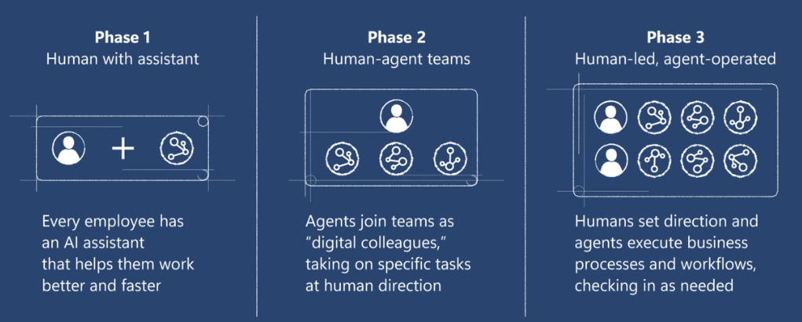

# Operating principles of Enterprise AI:
Các LLM vô cùng mạnh mẽ, nhưng cuộc chiến thực sự bây giờ nằm ở lớp ứng dụng, quan trọng là  làm cho chúng hữu ích hơn — chứng minh giá trị và thúc đẩy doanh thu

`Classification là để giải bài toán đã định nghĩa. Clustering là để khám phá bài toán cần giải`



**Enterprise AI (AI cho doanh nghiệp)** sẽ được định hình không bởi các mô hình AI riêng lẻ, mà bởi **mạng lưới các agent (tác tử AI)** tương tác, phối hợp linh hoạt trong toàn bộ hạ tầng doanh nghiệp

### **1. Hệ thống AI doanh nghiệp sẽ phi tập trung**

* Không còn AI trung tâm hóa, mà là sự **kết hợp đa tác tử xuyên suốt các hệ thống** trong doanh nghiệp.

### **2. Rào cản lớn nhất không phải mô hình AI, mà là khả năng tương tác**

* Việc **không tương thích giữa các hệ thống, công cụ và agent** sẽ khiến quá trình triển khai AI thất bại.

### **3. Các tiêu chuẩn như MCPs & agent-to-agent sẽ là "TCP/IP" mới**

* Những **giao thức chung để agent giao tiếp** sẽ là nền tảng không thể thiếu, như TCP/IP của Internet.

### **4. Điều phối agent là "chất keo" gắn kết hệ thống AI doanh nghiệp**

* Khả năng **phối hợp giữa các agent** sẽ tạo ra giá trị, chứ không chỉ là bản thân agent.

### **5. Orchestration sẽ chuyển từ quy tắc sang ngữ cảnh**

* Điều phối không còn cứng nhắc theo luật, mà sẽ **thích ứng theo bối cảnh, thông minh, linh hoạt.**

### **6. Agent không cần cấp bậc, mà sẽ phân vai theo mục tiêu**

* Trong mạng lưới agent, **sự chủ động đến từ "ý định", không phải "vai trò cấp bậc".**

### **7. Các nền tảng như Salesforce, Workday, Box... chỉ quản lý một phần quy trình**

* Không nền tảng nào kiểm soát toàn bộ hành trình khách hàng, cần sự **liên kết xuyên hệ thống.**

### **8. Kiến trúc nguyên khối đã lỗi thời**

* **Thế hệ mới là mạng lưới agent thông minh**, phối hợp mềm dẻo, tự điều chỉnh.

### **9. Agent không phải sản phẩm độc lập**

* **Chúng là thành phần tham gia vào luồng công việc**, không phải công cụ riêng lẻ.

### **10. AI có thể được lắp ghép như Lego**

* **Composable AI** cho phép tùy chỉnh các block chức năng, tạo hệ thống theo nhu cầu cụ thể.

### **11. AI không còn là lớp phụ trợ, mà là "kết cấu nền"**

* AI trở thành **phần vải liền mạch kết nối toàn bộ hệ sinh thái doanh nghiệp.**

### **12. AgentOps sẽ thay thế DevOps**

* Việc **quản trị, giám sát, vận hành agent** sẽ trở thành kỹ năng cốt lõi mới, tương tự DevOps ngày nay.

### **13. Debug sẽ chuyển từ code sang hội thoại giữa các agent**

* Không còn sửa lỗi dòng code, mà là **phân tích logic hội thoại giữa agent.**

### **14. Hệ thống CNTT cũ đã khó khăn – agent sẽ khiến khoảng cách càng lớn**

* Kiến trúc agent yêu cầu nền tảng hiện đại – **hệ thống cũ sẽ bị tụt lại xa hơn.**

### **15. Xây một agent dễ – để 50 agent hoạt động cùng nhau rất khó**

* **Tính phối hợp quy mô lớn là thách thức thật sự** trong kiến trúc AI doanh nghiệp.

### **16. Doanh nghiệp chưa sẵn sàng – dữ liệu chưa đủ điều kiện cho AI**

* Phần lớn dữ liệu **vẫn chưa truy cập được, chứ chưa nói đến dùng cho AI.**

### **17. Agent sẽ buộc doanh nghiệp phải cải tổ hạ tầng dữ liệu**

* Các yêu cầu mới từ mạng lưới agent sẽ **ép buộc doanh nghiệp nâng cấp data pipeline.**

### **18. Sự điều phối ngang sẽ phát sinh khi không hệ thống nào kiểm soát hoàn toàn**

* Trong các luồng công việc không có "chủ sở hữu", **agent sẽ phối hợp ngang hàng.**

### **19. Agent cần có khả năng kiểm toán, truy vết như hệ thống tài chính**

* **Minh bạch, truy xuất và giám sát hành vi của agent** sẽ trở nên thiết yếu.

### **20. Quản trị không chỉ là dữ liệu, mà cả hành vi của agent**

* Cần hệ thống **governance để kiểm soát cách agent vận hành và tương tác.**

### **21. Logic suy luận của agent sẽ chịu sự ràng buộc của quy định**

* **Compliance sẽ mở rộng sang cách suy nghĩ và hành động của AI.**

### **22. Agent chỉ đáng tin cậy nếu dữ liệu của nó đáng tin**

* **Chất lượng và nguồn dữ liệu là yếu tố quyết định độ tin cậy của agent.**

### **23. Cuộc đua AI sẽ không thắng bằng inference, mà bằng điều phối**

* Giá trị không nằm ở việc **AI trả lời thông minh đến đâu**, mà ở **cách agent phối hợp hiệu quả.**

### **24. Agent theo chiều dọc sẽ thống trị trước, orchestration ngang sẽ theo sau**

* Ban đầu sẽ là **agent chuyên sâu theo từng chức năng**, sau đó là **mạng lưới phối hợp đa năng.**

### **25. Giá trị cốt lõi nằm ở khả năng phối hợp agent xuyên hệ thống, theo thời gian thực**

* **Khả năng thích ứng và tương tác linh hoạt giữa các agent** mới là nơi tạo ra lợi thế.

### **26. Hãy tin vào "hành vi nổi lên" (emergent behavior)**

* Agent có thể phối hợp theo cách không dự đoán trước, nhưng vẫn **đúng mục tiêu và hợp lệ** – đó chính là tương lai cần chấp nhận và kiểm soát.

---
#### AI agents trong các hệ thống phức tạp:

1. **Tính phức tạp không đơn giản là “lộn xộn”**
```
đó là hệ thống nơi **nguyên nhân – kết quả không rõ ràng**

kết quả xuất hiện từ tương tác và không thể kiểm soát bằng logic tuyến tính

Càng cố kiểm soát, hệ thống càng dễ vỡ
```

2. **AI agents ngày nay giả định rằng thế giới có trật tự**
```
có thể học từ dữ liệu quá khứ để đưa ra hành động đúng

Nhưng các hệ thống con người như tuyển dụng, pháp lý, chẩn đoán, v.v. không vận hành theo cách đó

=> chúng là hệ thống phức tạp, tiến hóa theo ngữ cảnh và sự tham gia
```

3. **Các agent "tỏ ra hiểu biết", nhưng không có năng lực phán đoán**
```
chúng không sống trong thế giới thật => không cảm nhận hậu quả ~ không có tri thức ngầm (tacit knowledge)

Chúng đưa ra kết luận dựa vào dữ liệu, chứ không hiểu được giá trị của kết luận đó trong hoàn cảnh cụ thể
```

4. **Tri thức ngầm không thể mã hóa hoàn toàn bằng dữ liệu hay ngôn ngữ**
```
Nó được tích lũy từ trải nghiệm, từ sự tham gia, từ việc “ở trong cuộc” => cần hình thức hóa nó thành ontology

Khi ta cố biến cái ngầm thành cái rõ ràng (explicit) => đánh đổi là thường đánh mất chiều sâu và ý nghĩa
```

5. **Nguy cơ không nằm ở việc agent ngu ngốc**, mà là ở chỗ **chúng được yêu cầu hành động trong những hệ thống mà chúng không thể thực sự hiểu được**
```
Và con người lại tin tưởng chúng như thể chúng hiểu
```

6. Không phủ nhận việc xây dựng agent, nhưng cần **ý thức rõ bối cảnh đang can thiệp vào**
```
Trong hệ thống phức tạp, cần khung hỗ trợ (scaffolding), phản hồi, và sự tham gia

Chứ không phải quyết định giả tạo dựa trên ngôn ngữ trôi chảy

→ **Hãy biết khi nào nên dùng agent – và khi nào không nên.**
```

**Các vấn đề hiện tại của hệ thống agent gồm:**

```
cần xây dựng hệ thống vận hành bài bản (AgentOps) với sự tin cậy, thích nghi và bền vững là mặc định

Tương lai của agent còn rộng mở, nhưng sẽ không tự thành hình nếu chúng ta tiếp tục chạy theo làn sóng hype mà không xử lý những vấn đề cốt lõi
```

1. **Lập luận & Lên kế hoạch:**

   * Ảo giác thông tin, lý luận sai lệch, mâu thuẫn trong câu trả lời
   * Kế hoạch bất khả thi hoặc không hợp lý
   * Sử dụng sai công cụ hoặc API

2. **Hành động & Thực thi:**

   * Gọi sai công cụ hoặc thông số
   * Lỗ hổng bảo mật, prompt injection

3. **Bộ nhớ:**

   * Mất thông tin trong ngữ cảnh dài
   * Xung đột giữa trí nhớ bên trong và dữ liệu truy xuất
   * Ghi nhớ lỗi hoặc lỗi định điểm thông tin

4. **Môi trường:**

   * Quá tải CPU/RAM, độ trễ, thiếu cấu hình tài nguyên

5. **AI agent đa nhiệm và các vấn đề hệ thống:**

   * Thiết lập vai trò mơ hồ, xung đột giữa các agent
   * Vấn đề bảo mật, DDOS, hành vi độc hại
   * Thiếu kiểm soát truy cập và xác thực

6. **Lỗi phát sinh (emergent failures):**

   * Vòng lặp vô hạn, phân công chồng chéo, đình trệ tư duy

7. **Vận hành & Giám sát:**

   * Thiếu dữ liệu log, không thể kiểm soát nội bộ LLM
   * Không có tiêu chuẩn chẩn đoán lỗi rõ ràng
   * Thiếu thử nghiệm A/B, thiếu khả năng hoàn tác hoặc tự sửa lỗi

#### Thách thức và định hướng tương lai cho **AgentOps** 

* phân loại rõ các loại bất thường, từ đó đặt nền móng cho việc triển khai agent một cách đáng tin cậy và ổn định hơn trong tương lai
* khuôn khổ vận hành hệ thống agent, tập trung vào 4 giai đoạn chính:

1. **Giám sát (Monitoring):**
   Các công cụ hiện tại chủ yếu thu thập log, metric và trace, chưa bao quát được dữ liệu mô hình và checkpoint – vốn rất quan trọng trong hệ thống agent. Ngoài ra, dữ liệu quan sát quá lớn gây quá tải bộ nhớ. Tương lai cần phát triển giải pháp giám sát hiệu quả, có thể xử lý đa dạng dữ liệu quy mô lớn mà vẫn tiết kiệm tài nguyên.

2. **Phát hiện bất thường (Anomaly Detection):**
   Sự đa dạng của các bất thường khiến việc xây dựng một thuật toán phát hiện chung gặp khó khăn. Nếu dùng mô hình riêng cho từng loại lỗi sẽ gây quá tải hệ thống. Hướng đi tương lai là phát triển thuật toán nhẹ, hiệu quả, có khả năng phát hiện nhiều loại bất thường trong một khung thống nhất.

3. **Phân tích nguyên nhân gốc rễ (Root Cause Analysis):**
   Một bất thường có thể xuất phát từ nhiều nguyên nhân phức tạp ở các tầng khác nhau (hệ thống, mô hình, điều phối), gây khó khăn trong việc xác định chính xác nguyên nhân. Cần phát triển kỹ thuật suy luận nhân quả thông minh, có khả năng phân tích hiệu quả các lỗi phức tạp với chi phí thấp và tốc độ cao.

4. **Xử lý sự cố (Resolution):**
   Khác với hệ thống truyền thống, hành vi agent có tính xác suất và thích nghi, khiến việc xử lý lỗi không thể đơn giản hay cố định. Việc sửa lỗi cục bộ có thể gây ra hiệu ứng dây chuyền và bất ổn hệ thống. Do đó, cần cách tiếp cận lặp lại, kết hợp giám sát liên tục, kiểm thử nhiều vòng, các chiến lược hệ thống (rollback, guardrail...) và can thiệp ở mức mô hình (tối ưu prompt, tự điều chỉnh).
