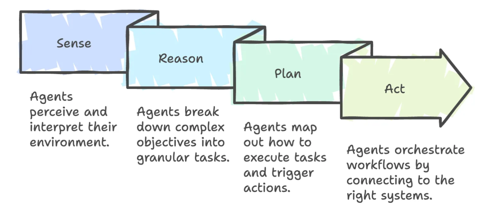

# Main concepts

### Kỹ thuật thiết kế Prompt là gì?
- #### Nó tập trung vào việc xây dựng các hướng dẫn cẩn thận để hướng dẫn mô hình AI tạo ra kết quả mong muốn + `ví dụ trực tiếp được đưa ra cho AI` (CoT)
- #### Tập trung vào cấu trúc và nội dung của câu hỏi/yêu cầu
- #### Sử dụng các từ khóa và cú pháp cụ thể để hướng dẫn phản hồi
- #### Thường bao gồm các ví dụ và hướng dẫn trực tiếp
- #### Có giới hạn trong việc khắc phục các khoảng trống kiến thức cơ bản
- #### `Prompt tốt đặt câu hỏi đúng`
- #### `Nhiệm vụ đơn giản:` Các nhiệm vụ như tóm tắt văn bản hoặc trả lời câu hỏi cơ bản có thể chủ yếu dựa vào kỹ thuật thiết kế prompt

#### Kỹ thuật thiết kế Ngữ cảnh là gì? ~ `"toàn bộ môi trường mà AI hoạt động"`
- #### Nó cung cấp tất cả kiến thức nền, dữ liệu và thông tin liên quan mà AI có thể truy cập để đưa ra phản hồi có ý nghĩa => `Tạo ra một "không gian thông tin" toàn diện cho AI hoạt động`
- #### Giúp AI hiểu được bối cảnh rộng lớn hơn của vấn đề
- #### Cho phép phản hồi sâu sắc hơn, đặc biệt đối với các vấn đề phức tạp
- #### `Ngữ cảnh tốt đảm bảo AI có thông tin cần thiết để trả lời`
- #### `Nhiệm vụ phức tạp:` Các nhiệm vụ như phân tích pháp lý, tư vấn y tế, hoặc nghiên cứu khoa học đòi hỏi sự kết hợp mạnh mẽ của cả hai phương pháp, với trọng tâm đặc biệt vào kỹ thuật thiết kế ngữ cảnh.

#### `Workflows`
- #### are systems where LLMs and tools are orchestrated through predefined code paths

#### `Agents`
- #### are systems where LLMs dynamically direct their own processes and tool usage, maintaining control over how they accomplish tasks
- #### `First` understand basic LLM workflows before building AI agents,

### `Intelligent agents`
- #### It is a complex, self-governed entity that perceives its environment and takes action to achieve certain goals or objectives
- #### It strictly adhere to a prede ned set of rules to highly advanced systems with the ability to learn and adapt from experience
- #### `Reactivity` ~ respond to changes and events occurring in their environment in real time => allows agents to adapt to dynamic conditions, ensuring their actions remain relevant and effective
- #### `Proactiveness` ~ predict future needs, challenges, or opportunities, and take the initiative to plan and act accordingly => goal-oriented and actively pursue strategies to achieve their objectives
- #### `Social ability` ~ Many intelligent agents operate in multi-agent systems => interact and cooperate with other agents or humans to achieve common goals

## `Sense-reasoning-plan-act cycle`

#### `Sensing` (cảm biến) 
- #### Agent perceives and acquires information about the environment => `determine desired outcomes`
- #### Event: `detect a new email` => `process and respond intelligently` as sale role in automating key tasks and streamlining workflows

#### `Knowledge updating` ~ the perceived information is used to update the agent’s internal knowledge base => maintains an accurate representation of the current state of the environment

#### `Planning and reasoning` 
- #### Uses LLM with advanced reasoning capabilities + chain-of-thought reasoning, reason-act (ReAct), and few-shot learning
- #### Agent employs reasoning techniques and algorithms to formulate plans and make decisions such as: `constraint satisfaction`, `logical inference`, `search algorithms`, or `heuristic-based planning`
- #### Event == interprets the desired objective ==> breaks objective down into granular tasks required to achieve it

#### `Plan execution` 
- #### Aent executes the corresponding actions in the environment => `potentially modifying the environment` or `achieving specific goals`
- #### Agents orchestrate workflows by seamlessly connecting to appropriate systems of record such as RAG, function calling
- #### To utilize short-term memory for active sessions 
- #### To tap into external apps for long-term memory, such as retrieving a customer’s preferences or purchase history stored in a database management system => empowers agents to deliver context-aware, personalized, and efficient outcomes

#### `Reactive architectures` 
- #### It uses simple condition-action rules for fast and low-level responses.

#### `Hybrid architectures`
- #### A reactive layer for fast and low-level responses
- #### A deliberative layer for high-level reasoning and planning
- #### `Task decomposition` ~ Break down complex tasks into subtasks that can be handled by the appropriate layer\
- #### `Multiplan selection`
  - #### `Deliberative layer` can generate multiple potential plans or strategies
  - #### `Reactive layer` can dynamically select and execute the most suitable plan based on the current environmental conditions
  - #### `Planning with external modules` ~ deliberative layer can incorporate external modules or specialized algorithms for tasks such as path planning, resource allocation, or scheduling, leveraging domain-speci c knowledge and techniques
  - #### `Reflection and refinement` ~ deliberative layer can reflect on the outcomes of executed plans, learn from experience, and refine its reasoning and planning processes accordingly, enabling continuous improvement and adaptation
  - #### `Memory-augmented planning` ~ deliberative layer can maintain a memory or history of past experiences, decisions, and outcomes, enabling it to leverage this knowledge in future planning and reasoning processes

### `Sense` -> `Reason` -> `p`