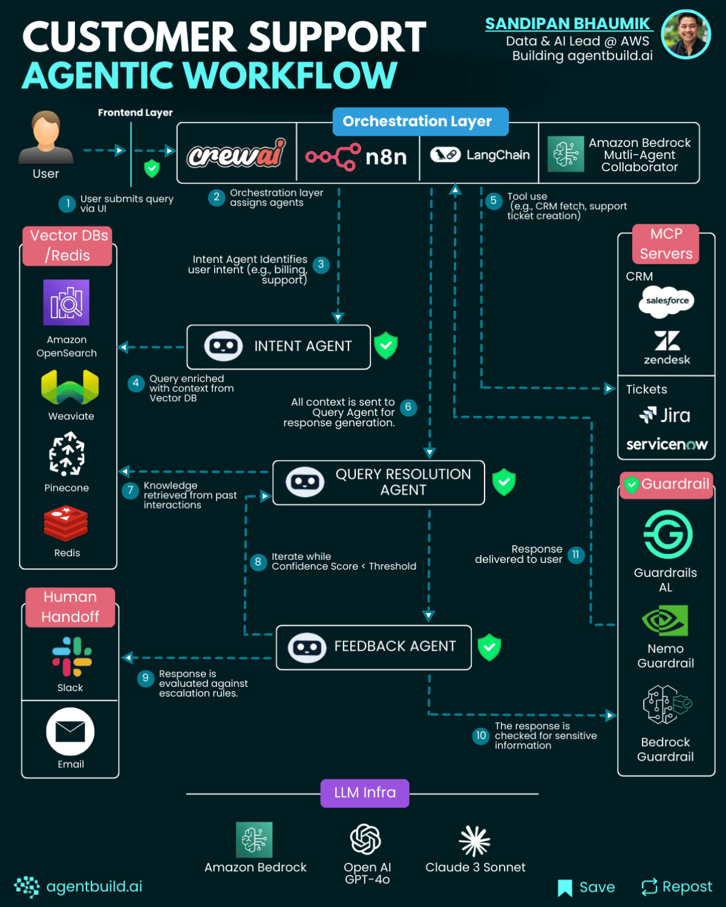

# Customer support workflow

### 𝟏. 𝐅𝐫𝐨𝐧𝐭𝐞𝐧𝐝 𝐋𝐚𝐲𝐞𝐫:
- ##### The user submits a query through a web or mobile interface.

### 𝟐. 𝐎𝐫𝐜𝐡𝐞𝐬𝐭𝐫𝐚𝐭𝐢𝐨𝐧 𝐋𝐚𝐲𝐞𝐫:
- ##### It analyzes the request and routes tasks to specialized agents based on the problem domain.

### 𝟑. 𝐈𝐧𝐭𝐞𝐧𝐭 𝐀𝐠𝐞𝐧𝐭:
- ##### Detects what the user needs (billing, account help, technical issue) and enriches the query using vector search across past tickets and documents.

### 𝟒. 𝐓𝐨𝐨𝐥 𝐈𝐧𝐭𝐞𝐫𝐚𝐜𝐭𝐢𝐨𝐧 𝐯𝐢𝐚 𝐌𝐂𝐏:
- ##### Securely connects to systems like CRMs or ticketing platforms to fetch data or trigger actions, no manual input required.

### 𝟓. 𝐐𝐮𝐞𝐫𝐲 𝐑𝐞𝐬𝐨𝐥𝐮𝐭𝐢𝐨𝐧 𝐀𝐠𝐞𝐧𝐭:
- ##### Uses all available context to generate a complete, relevant response using an LLM.

### 𝟔. 𝐅𝐞𝐞𝐝𝐛𝐚𝐜𝐤 𝐀𝐠𝐞𝐧𝐭:
- ##### Evaluates the output’s confidence level, improves it if needed, and determines whether it requires human escalation.

### 𝟕. 𝐆𝐮𝐚𝐫𝐝𝐫𝐚𝐢𝐥 𝐀𝐠𝐞𝐧𝐭:
- ##### Performs safety checks, ensuring no sensitive or non-compliant content is sent out.

### 𝟖. 𝐅𝐢𝐧𝐚𝐥 𝐃𝐞𝐥𝐢𝐯𝐞𝐫𝐲:
- ##### The orchestrator delivers the validated response back to the user via the original frontend channel.