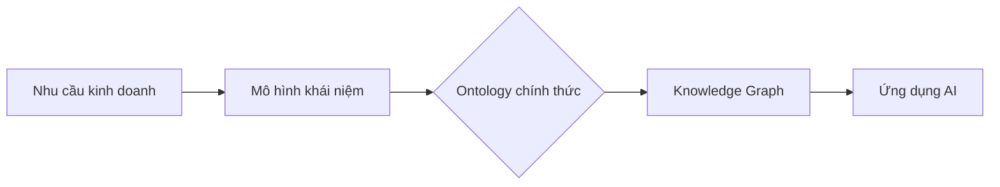

# Data product ontology
- #### https://ekgf.github.io/dprod/#abstract
- #### `Toàn bộ giá trị trên thị trường AI agent sẽ thuộc về chip và thứ mà chúng ta gọi là ontology`
- #### 💡 Nguyên tắc số 1: `Hiểu tất cả khách hàng` bởi:
```
→ Kiến thức chuyên sâu theo miền
→ Dữ liệu tái sử dụng được
→ Các LLM được tinh chỉnh kỹ càng

→ Every data point has context
→ Every decision has meaning
→ Every action has purpose
```
- #### ✅ Nguyên tắc số 2: `Suy nghĩ lớn, nhưng phải gói nó vào sản phẩm thực tế mà người dùng yêu`

* **Không cần code, không rườm rà cú pháp** — tập trung vào tư duy nghiệp vụ và miền kiến thức.
* **Ưu tiên trực quan** — dùng sơ đồ, biểu đồ nhiều hơn cấu trúc dữ liệu.
* **Phối hợp nhóm** — tạo sự đồng thuận giữa chuyên gia, lập trình viên và bên liên quan.

### 🚀 **Từ dữ liệu thô đến sản phẩm dữ liệu thật sự**

Mọi doanh nghiệp đều muốn trở thành tổ chức **dựa trên dữ liệu (data-driven)**, và một cách hiệu quả để làm điều đó là **xây dựng dữ liệu thành sản phẩm**

Nhưng chỉ đơn giản gói dữ liệu trong kho thành bảng biểu, metadata, hay schema thì chưa đủ — vì đó chưa phải là sản phẩm dữ liệu thực sự.

---

### 💡 **Vấn đề chính: Dữ liệu không nói cùng “ngôn ngữ” với doanh nghiệp**

* Dữ liệu thường được trình bày dưới dạng **bảng, cột, metadata, schema**.
* Trong khi đó, người dùng doanh nghiệp nói về **khách hàng, rủi ro, lợi nhuận, chiến lược giữ chân**.
* Giữa hai “thế giới” này, phần lớn giá trị của dữ liệu bị mất đi.

⚡ **Vấn đề không phải là dữ liệu, mà là vấn đề về ý nghĩa.** ⚡

---

### 🧩 **Giải pháp: Business Ontology**

**Business Ontology** là một cách chính thức, có thể đọc được bằng máy để mô tả cách doanh nghiệp suy nghĩ và hoạt động

Ontology không chỉ mô tả cấu trúc dữ liệu, mà còn định nghĩa các khái niệm như:

* “Khách hàng đang hoạt động (Active Customer)”
* “Doanh thu định kỳ hàng quý (Quarterly Recurring Revenue)”
* “Gián đoạn chuỗi cung ứng (Supply Chain Disruption)”

và thể hiện mối quan hệ giữa chúng.

---

### 🔗 **Gắn kết dữ liệu với ý nghĩa qua DPROD**

Ý tưởng là mỗi sản phẩm dữ liệu phải được liên kết với một khái niệm trong ontology doanh nghiệp.

* Sản phẩm dữ liệu chuỗi cung ứng cung cấp thông tin về các gián đoạn.
* Sản phẩm dữ liệu khách hàng tập trung vào khách hàng đang hoạt động.

DPROD — một Data Product Ontology mở — giúp bạn mô tả sản phẩm dữ liệu theo cách kết nối output với khái niệm trong ontology.

---

### 🌐 **Lợi ích**

* Người dùng dễ dàng **tìm kiếm và khám phá sản phẩm dữ liệu dựa trên ý nghĩa kinh doanh**.
* Ý nghĩa kinh doanh trở thành **cửa ngõ truy cập vào toàn bộ hệ sinh thái dữ liệu**.
* Mỗi sản phẩm dữ liệu là một **khối xây dựng trong lớp Semantic Layer** — bản đồ ý nghĩa phi tập trung, tự tổ chức và phát triển theo thời gian.
* Ontology tạo cấu trúc cho dữ liệu, dữ liệu làm sống động ontology.

---

Dưới đây là bản tóm tắt tương tự, dễ hiểu và súc tích:

---

### 🌍 **Hiểu khách hàng mọi ngôn ngữ, giảm chi phí 35%**

Mỗi ngày, doanh nghiệp xử lý lượng dữ liệu khổng lồ. Với dữ liệu có cấu trúc thì dễ, nhưng khoảng một nửa dữ liệu doanh nghiệp là **dữ liệu phi cấu trúc** — email, chat, tài liệu — rất khó xử lý, tốn nhiều nhân lực và thời gian.

---

### 🤐 **Khách hàng không nói “ngôn ngữ doanh nghiệp” thường bị hiểu sai hoặc bỏ qua**

Mỗi công ty có một “ngôn ngữ nội bộ”. Khách hàng dùng ngôn ngữ khác thường không được hiểu đúng, trở nên “vô hình”.

---

### 🤖 **LLMs như ChatGPT đã thay đổi cuộc chơi — nhưng vẫn còn hạn chế**

Các mô hình này được huấn luyện trên nội dung internet tổng quát, chủ yếu là tiếng Anh. Chúng không hiểu sản phẩm của bạn, không biết ngôn ngữ riêng và đôi khi tạo ra thông tin sai (hallucination).

### 🚀 **Lợi ích**

* Khách hàng được hỗ trợ ngay lập tức bằng nhiều ngôn ngữ qua tìm kiếm và chatbot đa ngôn ngữ.
* Tiết kiệm thời gian quý báu tại mọi điểm tiếp xúc.
* Giảm lỗi AI “tạo chuyện” khi kết hợp LLM với tri thức và dữ liệu thực tế của bạn.

### ⚙️ **Vai trò trong phát triển Ontology**

Bắt đầu từ nhu cầu kinh doanh => tạo mô hình khái niệm => rồi chuyển thành ontology chính thức => cuối cùng xây dựng knowledge graph phục vụ AI



* **Đầu vào:** Kiến thức chuyên môn, mục tiêu doanh nghiệp
* **Đầu ra:** Biểu đồ UML/OntoUML, định nghĩa khái niệm
* **Công cụ:** Whiteboard, Visual Paradigm, Protégé

### 🏗️ **4 Thành phần cốt lõi của Mô hình hóa Khái niệm**

1. **Lớp (Classes):** Các khái niệm chính (ví dụ: `Máy móc`, `Cảm biến`, `Báo cáo bảo trì`)
2. **Mối quan hệ (Relationships):** Cách các lớp liên kết (ví dụ: `Máy có Cảm biến`, `Cảm biến kích hoạt Cảnh báo`)
3. **Thuộc tính (Attributes):** Tính chất của lớp hoặc mối quan hệ (ví dụ: `Máy: số seri`, `Cảnh báo: mức độ nghiêm trọng`)
4. **Ràng buộc (Constraints):** Quy tắc nghiệp vụ (ví dụ: “Máy quan trọng phải kiểm tra hàng ngày”)

---

### 🚀 **Multi-agent reasoning** đang trở thành nền tảng cho AI thế hệ mới.

**Knowledge graphs** và **ontology-driven communication** — giúp các agent suy luận, lập kế hoạch và phối hợp thông minh hơn.

Trong dự án gần đây xây dựng trợ lý RAG cho tuân thủ nhân sự, có nhận thấy:

* Logic dự phòng giữa các agent
* Sự trôi nghĩa trong tìm kiếm ngữ nghĩa
* `Metadata giải thích` là những yếu tố then chốt — đặc biệt khi “kiến thức” không chỉ kỹ thuật mà còn mang tính quy định pháp lý

Vấn đề này rất quan trọng với những ai làm trong lĩnh vực tuân thủ hoặc môi trường rủi ro cao:

👉 Làm sao để ontology grounding và chuyên môn hóa agent mở rộng được khi sự mơ hồ luôn tồn tại?
