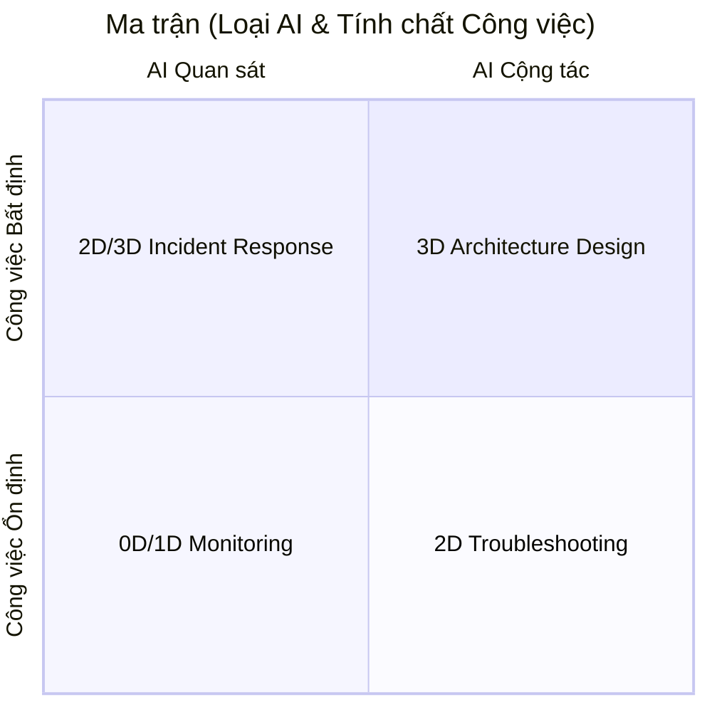

# Ma trận thiết kế công việc
> Bản chất công việc này là gì, mức độ bất định ra sao, và cần kiểu tương tác nào giữa `AI – con người – hệ thống`?
> * Công việc càng ổn định → AI càng nên tự động
> * Công việc càng bất định → AI càng nên cộng tác

Giá trị của vận hành **BAU**:
> Con người không nên tiêu hao sự chú ý cho trạng thái bình thường; con người nên tập trung vào sự thay đổi
* phát hiện sớmn -> giảm tác động -> ngăn lỗi lặp lại
* Bởi nhìn theo hệ thống, nghĩ về rủi ro, kiểm tra giả định, ghi nhận bài học.

```
Bất thường
   ↓
0D: phát hiện
(lấy tín hiệu)
   ↓
1D: thu thập thông tin
(từ các công cụ sẵn có)
   ↓
2D: tạo giả thuyết
(tạo hiểu biết vấn đề)
   ↓
3D: phối hợp các bên
(điều phối)
   ↓
Cập nhật lại hệ thống
```

#### Hệ thông tự học
```
(Kinh nghiệm của người vận hành)
        ↓
Pattern của hệ thống
        ↓
Quy tắc vận hành
        ↓
Cảnh báo trước khi lỗi xảy ra
```
```
Sự kiện xảy ra
      ↓
AI ghi nhận
      ↓
Tìm pattern
      ↓
Cập nhật hiểu biết hệ thống
      ↓
Phát hiện sớm lần sau
      ↓
Giảm xác suất lặp lỗi
```

#### Mô hình flywheel
* AI càng hiểu khách hàng
* khách hàng càng phụ thuộc
* giá trị chuyển đổi sang 2D/3D càng lớn

```
Cài 0D
 ↓
Quan sát hệ thống
 ↓
Thu thập trạng thái bình thường
 ↓
Thu thập trạng thái bất thường
 ↓
Hiểu nguyên nhân
 ↓
Cải thiện dự đoán
 ↓
Tạo giá trị cao hơn
```

**Trục 1: Tính ổn định của công việc (Work Nature)**
|                        |                                                  |
| ---------------------- | ------------------------------------------------ |
| **Routine / BAU**      | Công việc lặp lại, có quy luật, có tiêu chuẩn rõ |
| **Adaptive / Non-BAU** | Công việc cần phán đoán, xử lý tình huống mới    |

**Trục 2: Mức độ can thiệp của AI (AI Interaction Mode)**
| Mức    | Ý nghĩa                                                    |
| ------ | ---------------------------------------------------------- |
| **0D** | AI quan sát hệ thống, chỉ báo khi bất thường               |
| **1D** | Con người gọi AI để hỗ trợ                                 |
| **2D** | AI và con người trao đổi, phản biện, xác nhận              |
| **3D** | AI hỗ trợ sự phối hợp giữa nhiều thành phần trong hệ thống |

| Mức    | Câu hỏi chính                                            | Vai trò AI                                            | Phạm vi                             |
| ------ | -------------------------------------------------------- | ----------------------------------------------------- | ----------------------------------- |
| **0D** | "Có gì bất thường không?"                                | Quan sát, phát hiện sai lệch, cảnh báo                | Hệ thống vận hành                   |
| **1D** | "Hãy cho tôi biết sâu hơn về chuyện này"                 | Truy xuất, phân tích, đào sâu thông tin theo yêu cầu  | Một người vận hành + dữ liệu        |
| **2D** | "Có những khả năng nào và tôi nên cân nhắc gì?"          | Sinh giả thuyết, tổng hợp bằng chứng, đưa ra lựa chọn | Một người vận hành + một quyết định |
| **3D** | "Vấn đề này vượt khỏi phạm vi của tôi, ai cần tham gia?" | Điều phối liên chức năng, quản lý phụ thuộc           | Nhiều nhóm trong tổ chức            |



**Devops job**
| Công việc DevOps    | Tính chất                   | Mức AI phù hợp | Ví dụ                             |
| ------------------- | --------------------------- | -------------- | --------------------------------- |
| Server monitoring   | BAU, ổn định                | 0D             | AI cảnh báo CPU cao               |
| Log analysis        | BAU + cần hỗ trợ            | 1D             | AI tìm lỗi trong log              |
| CI/CD               | Có quy trình + cần trao đổi | 2D             | AI hỏi điều kiện trước deploy     |
| Incident response   | Bất định                    | 2D             | AI cùng điều tra nguyên nhân      |
| Cloud architecture  | Phức tạp, nhiều bên         | 3D             | AI điều phối trade-off            |
| Engineering culture | Xã hội, dài hạn             | 3D             | AI hỗ trợ cải thiện cách phối hợp |

#### Monitoring CPU tăng cao
> Đây là **BAU + ít bất định**<br>
=> Thiết kế phù hợp: 0D

**Bản chất công việc**
* Có metric rõ.
* Có ngưỡng cảnh báo.
* Có quy trình xử lý.

AI Agent:
> theo dõi CPU, memory, latency, error rate, log.

* Khi bình thường:
  > Không làm gì

* Khi bất thường:
    ```
    CPU server A:
    95% trong 10 phút
    
    Nguyên nhân khả nghi:
    - API /payment tăng traffic
    - query database chậm
    
    Đề xuất:
    - kiểm tra deployment lúc 14:20
    ```
    
    > Con người quyết định


#### Viết CI/CD pipeline
> Thiết kế phù hợp: 1D → 2D

**Bản chất công việc**
* Có phần lặp lại nhưng cần người hiểu bối cảnh.
* Ví dụ: Dev muốn:
    > Deploy service mới

    * DevOps cần:
        * tạo Dockerfile,
        * tạo pipeline,
        * cấu hình environment.

DevOps hỏi AI:
> Tạo pipeline GitHub Actions cho service Node.js này

* AI tạo bản nháp
* Sau đó AI hỏi lại:
    > "Production có yêu cầu rollback tự động không?" <br>
    > "Có cần approval trước deploy không?"

    AI không chỉ viết code.
    Nó ép người dùng suy nghĩ đủ điều kiện.

#### Xử lý sự cố production

Ví dụ: `Website bị chậm lúc 10 giờ sáng`
Đây là công việc:
* dữ liệu chưa đầy đủ,
* nguyên nhân chưa biết,
* cần kinh nghiệm.

 => **non-BAU** => Thiết kế phù hợp: 2D

AI Agent thu thập:
* log,
* metric,
* trace,
* deployment history.

Sau đó AI tạo đối thoại:
> Tôi thấy latency tăng sau deployment v1.4.2, nhưng database connection chưa tăng. <br>
Có hai giả thuyết...

DevOps:
> Loại bỏ giả thuyết A vì hôm nay traffic khác

AI:
> Cập nhật lại phân tích

=> **vòng lặp tư duy**

#### Thiết kế kiến trúc hệ thống mới
> Không chỉ là kỹ thuật, nó tối ưu đa mục tiêu nhiều bên liên quan => trade-off:
> * Product muốn nhanh.
> * Finance muốn giảm chi phí.
> * Security muốn kiểm soát.
> * Dev muốn dễ phát triển.

=> Thiết kế phù hợp: 3D
```
Product Owner
      ↕
      AI
      ↕
    Developer
      ↕
      AI
      ↕
    DevOps
      ↕
    Security
```
