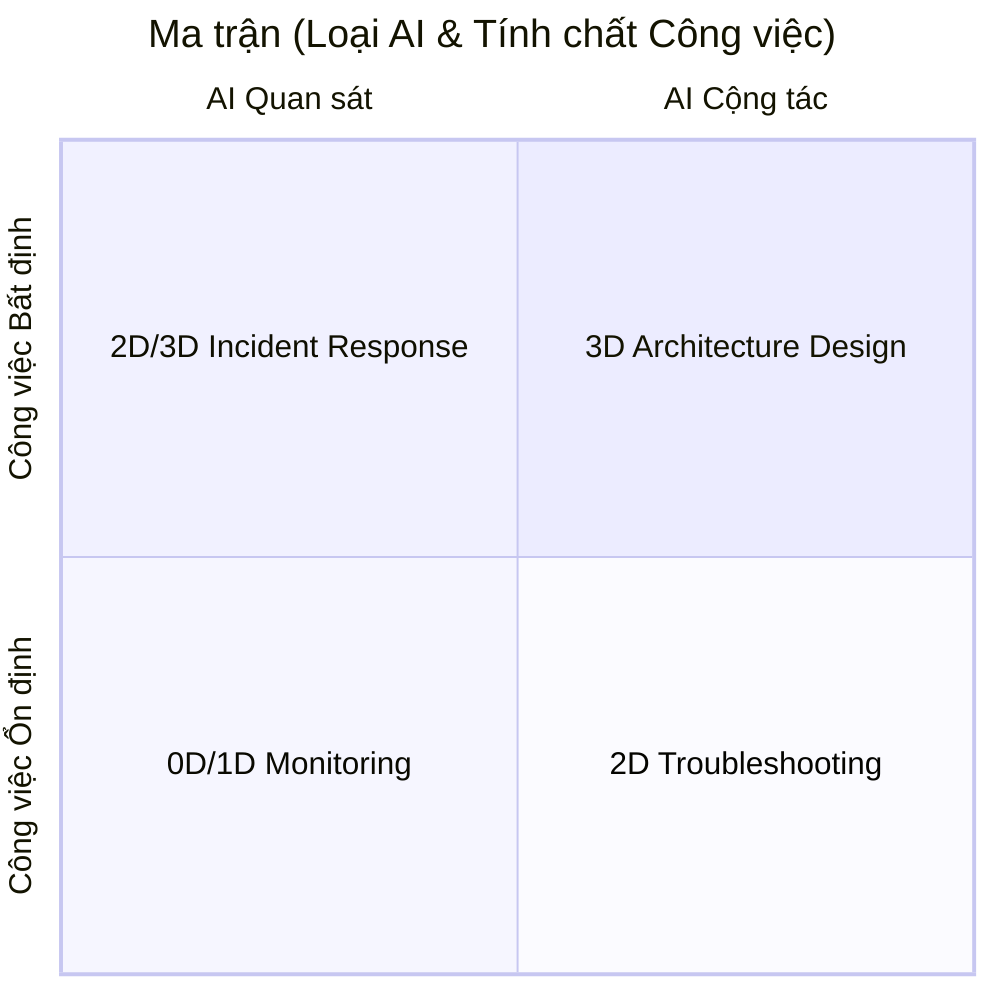

# Ma trận thiết kế công việc
> Bản chất công việc này là gì, mức độ bất định ra sao, và cần kiểu tương tác nào giữa `AI – con người – hệ thống`?

**Trục 1: Tính ổn định của công việc (Work Nature)**
|                        |                                                  |
| ---------------------- | ------------------------------------------------ |
| **Routine / BAU**      | Công việc lặp lại, có quy luật, có tiêu chuẩn rõ |
| **Adaptive / Non-BAU** | Công việc cần phán đoán, xử lý tình huống mới    |

**Trục 2: Mức độ can thiệp của AI (AI Interaction Mode)**
| Mức    | Ý nghĩa                                                    |
| ------ | ---------------------------------------------------------- |
| **0D** | AI quan sát hệ thống, chỉ báo khi bất thường               |
| **1D** | Con người gọi AI để hỗ trợ                                 |
| **2D** | AI và con người trao đổi, phản biện, xác nhận              |
| **3D** | AI hỗ trợ sự phối hợp giữa nhiều thành phần trong hệ thống |

