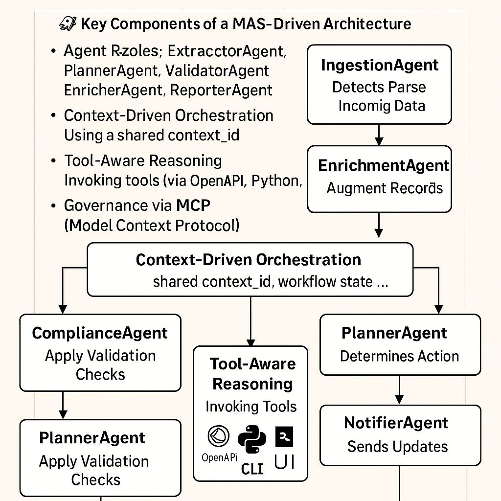
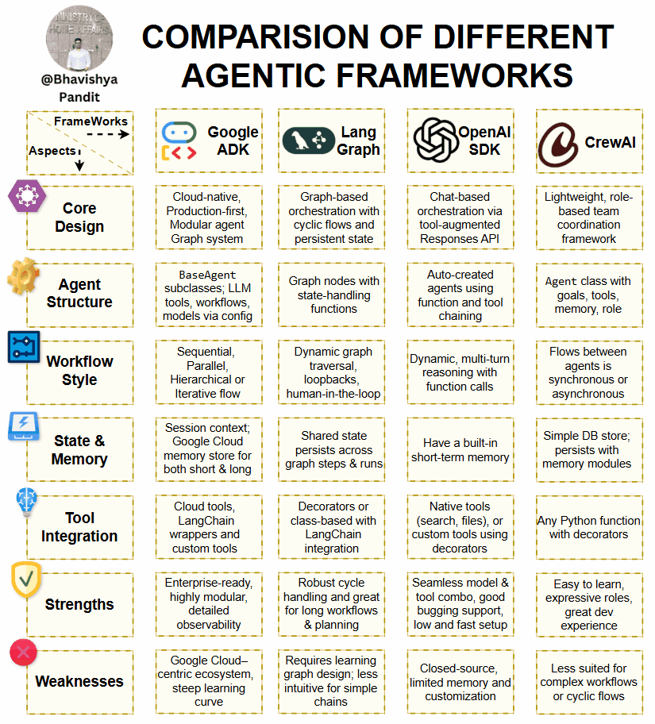

# Multi-agent system
- #### `Langgraph` giúp xây hệ thống multi-agent có trạng thái
- #### `Autogen` giúp thiết lập hội thoại multi-agent
- #### `CrewAI` giúp các agents phối hợp theo vai trò + kế hoạch
- #### `[LangChain Agent Executor]` giúp agent gọi công cụ theo ReAct


- #### is a system comprising multiple autonomous agents that can interact, collaborate, and cooperate to achieve shared goals
- #### `Negotiation` ~ is the process through which agents reach agreements on how to share resources, divide tasks, or resolve conflicts


- #### `Autonomy` ~ each agent makes self-contained decisions based on its perception of the environment and its objectives
- #### `Interaction` ~ to share information, negotiate tasks, and coordinate their actions
- #### `Adaptability` ~ exibility to adapt and change their behavior in response to changes in the environment or changes in the individual agents’ goals


### `AI interface`
- #### is a collection of functions, tools, and data layers
- #### that expose data and applications by natural language

### Multi-agent with `Supervisor Architecture`

- #### Trade-off between `agency`(LLM’s capacity to act autonomously) and `reliability`(the degree to which we can trust its outputs)


### `Agent` profle
- #### `Persona` ~ `system prompt` guides an agent to complete tasks, learn how to respond, ...

- #### Understanding the `action target` helps us define clear objectives for task completion, exploration, or communication

- #### Agents use `knowledge and memory` to annotate context with the most pertinent information while limiting the number of tokens used

- #### `Reasoning and evaluation systems` annotate an agent’s workflow by providing an ability to think through problems and evaluate solutions

- #### Agent organizes tasks to achieve higher-level goals with:
  - #### `Planning without feedback` for autonomous agents make decisions independently
  - #### `Planning with feedback` for monitoring and modifying plans by `input`, `env changes` and `direct human feedback`

### Coordinator agent
- #### `backstory` provides depth and context to how the agent approaches its responsibilities.
- #### Design `backstory` is a carefully crafted narrative that shapes the agent’s decision-making process, interaction style, communicates with other agents, and approaches problem-solving
```python
coordinator = Agent(
  role="Strategic Planning Manager",
  backstory="A veteran project manager who has successfully led diverse teams in Silicon Valley startups, known for
    balancing innovation with practical execution. Expertise in bridging communication gaps between technical and
    non-technical teams while maintaining focus on key deliverables.",
  verbose=True
)
```

### Principles of role-based modeling
- #### `Separation of interaction logic` from inner algorithmic logic ~ design collaborative LLM agents that need to coordinate effectively while maintaining clear responsibilities and interaction patterns
- #### `Dynamic role assignment` ~ by assigning speci c roles to agents based on their capabilities and the system’s requirements
- #### `Modular system organization` ~ supports the separation of concerns and allows for modular and reusable design in multi-agentsystems

### `Manager` agent ~ coordinators in CWD model
- #### is responsible for monitoring the system’s operations, managing resources, and ensuring timely task completion
- #### Monitoring the progress of planning processes
- #### Allocating resources (for example, computational resources and access to external APIs) to other agents
- #### Ensuring that plans are generated within specified time constraints

### `Analyst` agent ~ workers in CWD model
- #### possesses expertise in analyzing data and providing insights and recommendations based on its findings
- #### can inform and guide decision-making processes within the system
- #### Analyzing customer preferences and trends
- #### Providing recommendations based on data analysis
- #### Identifying potential cost-saving opportunities
- #### Summarizing outcomes and recommendations for the user

### `Reflector` agent ~ workers in CWD model
- #### observes the system’s performance and identifies areas for improvement
- #### can suggest changes or adjustments that would enhance efficiency and effectiveness
- #### Analyze customer feedback and satisfaction levels
- #### Identify bottlenecks or inefficiencies in the planning process
- #### Propose improvements to the system’s algorithms or workflows

### `Searcher` agent ~ workers in CWD model
- #### explores the problem space, constantly seeking new solutions and sharing relevant information with other agents
- #### involves innovation, adapts the system to cope with novel situations
- #### Discover new activities, approaches
- #### Explore alternative options or workflows
- #### Share information about emerging trends or regulations with other agents

#### `Task Interpreter` ~ delegators in CWD model
- #### serves as a bridge between the coordinators and workers, mapping high-level tasks into lower-level, concrete, and performable actions for the worker agents
- #### ensures that tasks are well de ned and understood by the workers.
- #### Break down a customer’s request into specific subtasks (for example, fight booking, hotel reservation, or activity planning)
- #### Translate the customer’s preferences into actionable tasks for the worker agents
- #### Ensure that the tasks assigned to the worker agents are clear and unambiguous


### `Why Enterprises Are Adopting MAS`
- #### `Decoupled Architecture` – Each agent evolves independently
- #### `Cognitive Orchestration` – LLMs plan next steps based on SOPs and context
- #### `Audit-Ready` – Full traceability of every decision and data change
- #### `Scalable & Observable` – Agents can be deployed and monitored as microservices


### So sánh giữa các AI agentic frameworks