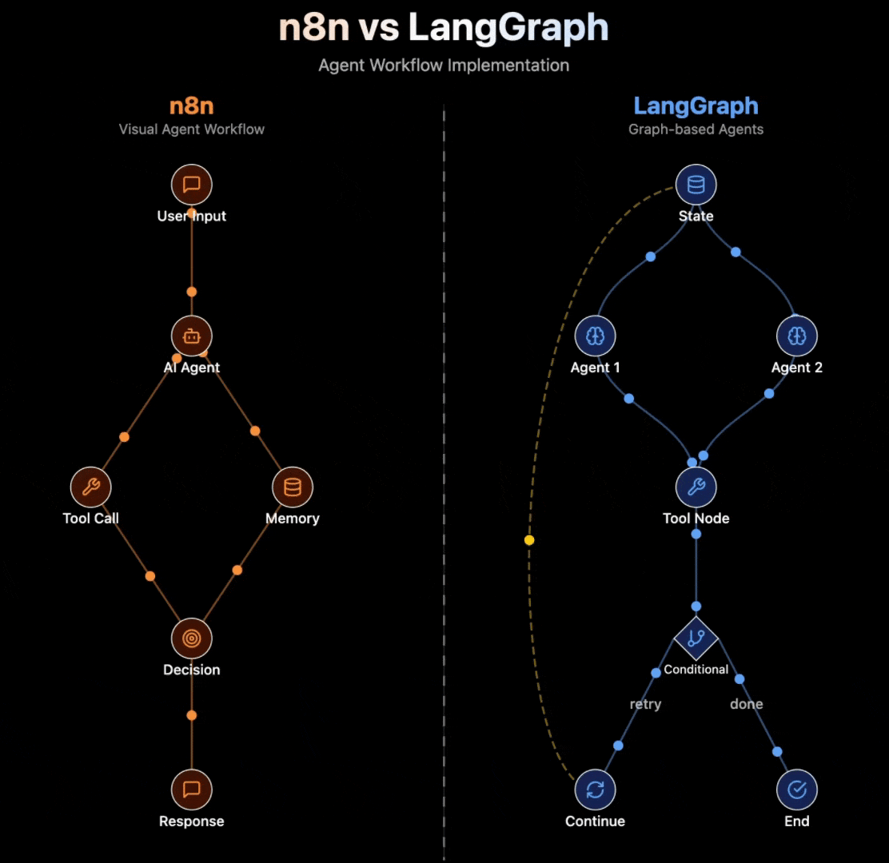

# N8N vs langgraph

### `𝗻𝟴𝗻` (𝗩𝗶𝘀𝘂𝗮𝗹 𝗪𝗼𝗿𝗸𝗳𝗹𝗼𝘄 𝗔𝘂𝘁𝗼𝗺𝗮𝘁𝗶𝗼𝗻)
- #### Creates visual connections between AI agents and business tools
- #### Flow: Trigger → AI Agent → Tools/APIs → Action
- #### Solves integration complexity and enables rapid deployment
- #### Think of it as the visual orchestrator connecting AI to your entire tech stack

### `𝗟𝗮𝗻𝗴𝗚𝗿𝗮𝗽𝗵` (𝗚𝗿𝗮𝗽𝗵-𝗯𝗮𝘀𝗲𝗱 𝗔𝗴𝗲𝗻𝘁 𝗢𝗿𝗰𝗵𝗲𝘀𝘁𝗿𝗮𝘁𝗶𝗼𝗻) by LangChain
- #### Enables stateful, cyclical agent workflows with precise control
- #### Flow: State → Agents → Conditional Logic → State (cycles)
- #### Solves complex reasoning and multi- #### #### step agent coordination
- #### Think of it as the brain that manages sophisticated agent decision- #### #### making

### 𝗪𝗵𝗲𝗻 𝘁𝗼 𝘂𝘀𝗲 𝗻𝟴𝗻:
- #### Integrating AI agents with existing business tools
- #### Building customer support automation
- #### Creating no-code AI workflows for teams
- #### Needing quick deployment with 700+ integrations

### 𝗪𝗵𝗲𝗻 𝘁𝗼 𝘂𝘀𝗲 𝗟𝗮𝗻𝗴𝗚𝗿𝗮𝗽𝗵:
- #### Building complex multi-agent reasoning systems
- #### Creating enterprise-grade AI applications
- #### Developing agents with cyclical workflows
- #### Needing fine-grained state management

### 𝗻𝟴𝗻 𝗘𝗰𝗼𝘀𝘆𝘀𝘁𝗲𝗺:
- #### Visual workflow builder for non-developers
- #### Self-hostable open-source option
- #### Strong business automation community

### 𝗟𝗮𝗻𝗴𝗚𝗿𝗮𝗽𝗵 𝗘𝗰𝗼𝘀𝘆𝘀𝘁𝗲𝗺:
- #### Full LangChain ecosystem integration
- #### LangSmith observability and debugging
- #### Advanced state persistence capabilities

### Top AI solutions integrate both n8n and LangGraph to maximize their potential.
- #### Use n8n for visual orchestration and business tool integration
- #### Use LangGraph for complex agent logic and state management
- #### Think in layers: business automation AND sophisticated reasoning

### People who: 
- #### 👉 Understand AI capabilities and data limitations
- #### 👉 Translate messy business needs into structured, reusable data
- #### 👉 Define Data Products with AI-readiness in mind
- #### 👉 Treat prompts and metadata as part of the same design

### Here’s what companies should do now:
- #### ✅ Create cross-functional `"AI+Data Pods"`
- #### ✅ Incentivize shared outcomes (not siloed wins)
- #### ✅ Invest in data product managers with ML context
- #### ✅ Stop thinking of data as ‘infrastructure’, and start treating it like code for intelligence