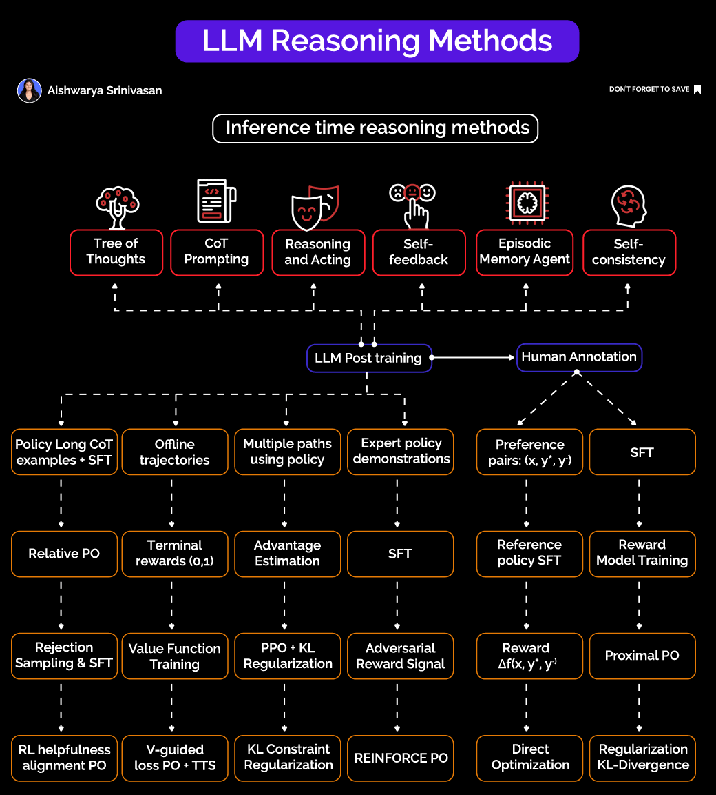

# Prompt engineering
- #### Prompting is about shaping behaviour, which must be:
    - #### Repeatable
    - #### Testable
    - #### Maintainable
- #### `𝐓𝐞𝐱𝐭 = 𝐂𝐨𝐝𝐞 𝐏𝐫𝐨𝐦𝐩𝐭𝐬 = 𝐒𝐲𝐬𝐭𝐞𝐦𝐬` ~ `If your agents run on prompts, you need to treat them like production code.` 

### Prompt engineering lifecyle
- #### `𝟏. 𝐃𝐞𝐬𝐢𝐠𝐧`
    - #### Like software, it starts with intent.
    - #### Define the agent’s role, the task, and the output expectations.
    - #### Set tone, constraints, and structure. Think of it like writing an API contract in plain English.

- #### `𝟐. 𝐓𝐞𝐬𝐭 - 𝐃𝐞𝐩𝐥𝐨𝐲`
    - #### Test against edge cases, noisy context, and failure scenarios.
    - #### Once stable, prompts are deployed into real workflows and applications where they become executable logic.

- #### `𝟑. 𝐌𝐨𝐧𝐢𝐭𝐨𝐫`
    - #### Prompts don’t stay perfect.
    - #### As models and data evolve, so does behavior.
    - #### Observability is essential to ensure quality over time.

- #### `𝟒. 𝐒𝐞𝐜𝐮𝐫𝐞`
    - #### Prompts break systems if left unchecked: `Prompt injection`, `Unsafe tool calls`, `Data leaks`
    - #### Prompt engineering includes governance and guardrails.


### Some chatGPT prompts



### `LLM can reason` by right post-training.
#### ✅ Inference-time reasoning methods, which can be applied at inference time, without needing to retrain your model:
- #### Tree of Thoughts (ToT), search through reasoning paths
- #### Chain of Thought (CoT) prompting, prompt models to generate intermediate reasoning steps
- #### Reasoning + Acting, use tools or function calls during reasoning
- #### Self-feedback, prompt the model to critique and refine its own output
- #### Episodic Memory Agents, maintain a memory buffer to improve multi-step reasoning
- #### Self-consistency, sample multiple reasoning paths and select the most consistent answer

### A RAG prompt
```text
Here is a user query: {query}.
And relevant context:
{context}
Please respond to the user query using information and facts provided in the context.
```


## 🔧 Prompting chỉ là bề nổi — Context Engineering là tầng suy nghĩ

Prompting vẫn hữu dụng — nó là điểm khởi đầu. Nhưng **Context Engineering** mới là nơi **tư duy hệ thống thật sự bắt đầu**.

Chúng ta không chỉ cần mô hình **nói ra điều gì đó**, mà cần mô hình **hiểu điều đó, suy luận, và cải thiện qua thời gian**.

Việc phân tích các yếu tố như:

* công cụ (tools),
* bộ nhớ (memory),
* truy xuất có bổ trợ (RAG),
* và chiến lược phân bổ token (token budgeting)

…là điều mà hầu hết nhóm AI đang thiếu.

Chúng ta không còn “chơi chữ” với mô hình nữa — **mà đang bắt đầu thiết kế logic.**

---

## 🧠 Từ lý thuyết đến thực tiễn

Hoàn toàn đúng khi nói: **không có một framework scale được nếu chỉ dựa vào trial-and-error prompt**.

> “Teaching the model what matters, why it matters, and how to reason about it”
> — đó không phải là prompt nữa, đó là **dạy tư duy**.

Đặc biệt là việc **kiến trúc để xử lý overflow**, đó là vấn đề ngày càng rõ khi:

* context window tăng,
* dữ liệu đầu vào ngày càng phức tạp,
* và không có chiến lược pruning/token budgeting tốt thì mô hình sẽ bị "ngộp".

---

## 🛠 Vai trò của công cụ: Tooling cho Context Design

Một câu hỏi đáng giá: **tooling nào giúp thực hiện được context engineering một cách thực tiễn?**

Các xu hướng đáng chú ý hiện nay:

* **LangGraph, LangChain Expression Language (LCEL)**: Cho phép xây dựng context flow có kiểm soát (stateful logic).
* **LlamaIndex, Haystack**: Hỗ trợ semantic chunking, context injection có cấu trúc.
* **PromptLayer, Traceloop**: Tracking + debugging prompt/context behavior để học từ thực tế.
* **MemGPT, Agentic memory frameworks**: Khởi đầu cho “LLM với trí nhớ thật sự” — rất quan trọng cho context dài hạn.
* **tiktoken + Custom token routers**: Để phân bổ và kiểm soát token budget theo mục tiêu.

---

## 💡 Tóm lại

> “It’s not just about what the model says — it’s about what it sees, and why it should care.”

* **Context là hạ tầng (infrastructure)**
* **Engineering là giao diện (interface)**
* **Reasoning là kết quả (outcome)**

Khi thiết kế context đúng cách, bạn không còn cần prompt thông minh nữa — bạn có một **hệ thống có tư duy**.
