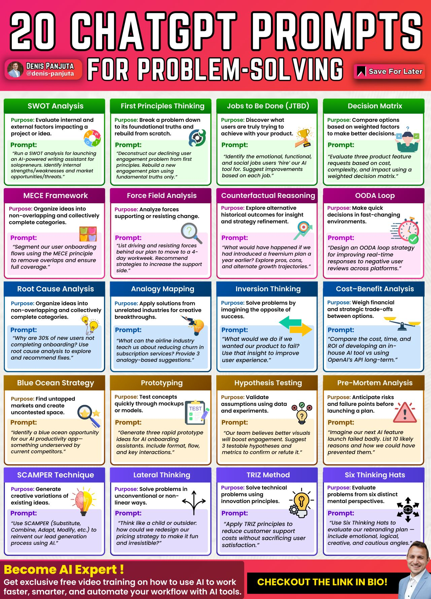

# Prompt engineering && Context engineering 

- #### Prompting is about shaping behaviour, which must be:
    - #### Repeatable
    - #### Testable
    - #### Maintainable
- #### `𝐓𝐞𝐱𝐭 = 𝐂𝐨𝐝𝐞 𝐏𝐫𝐨𝐦𝐩𝐭𝐬 = 𝐒𝐲𝐬𝐭𝐞𝐦𝐬` ~ `If your agents run on prompts, you need to treat them like production code.` 

### Prompt engineering and context engineering lifecyle
| Giai đoạn            | Prompt                                      | Context                                                                                                          |
| -------------------- | ------------------------------------------- | ---------------------------------------------------------------------------------------------------------------- |
| **1. Design**        | Xác định vai trò, đầu ra, cấu trúc prompt   | Xác định nguồn context: schemas, facts, tone, format. Chọn chunking, định nghĩa metadata.                        |
| **2. Test - Deploy** | Kiểm thử prompt với dữ liệu đầu vào đa dạng | Kiểm thử context retrieval (đủ/ngắn/gọn/lọc đúng). Đánh giá performance trong tác vụ thực tế.                    |
| **3. Monitor**       | Theo dõi hành vi model khi prompt thay đổi  | Theo dõi tính liên quan, lỗi truy xuất, "context drift" (khi dữ kiện cũ/lỗi vẫn lọt vào)                         |
| **4. Secure**        | Tránh prompt injection, misuse              | Ngăn context chứa dữ liệu nhạy cảm, kiểm soát truy xuất (context-level security), quản lý nguồn tin đáng tin cậy |

## 🧠 Vì sao quản lý context lifecycle là quan trọng?

1. **Context = logic + dữ liệu → quyết định đầu ra của model**

   * Nếu prompt là “API”, thì context là “dữ liệu đầu vào” cho API đó
2. **Context cần kiểm soát chất lượng như code**:

   * Không để trùng lặp, lỗi, xung đột nguồn → tránh hallucination
3. **Context sống động**:

   * Nó thay đổi theo thời gian, phiên bản model, hành vi người dùng → cần quan sát và bảo trì

## 🔧 Các hành vi trong từng giai đoạn với context

### 1. **Design**

* Lựa chọn rõ: nguồn context nào → mục tiêu nào?
* Gắn metadata (loại, độ tin cậy, ngày cập nhật, ID…)
* Chuẩn hóa cấu trúc: schema, field name, canonical terms

### 2. **Test - Deploy**

* Thử trên các truy vấn lệch hướng, thiếu thông tin
* Đánh giá các truy xuất: đủ chưa, chính xác không, quá dài không?
* Đưa vào workflow → xem ngữ cảnh phản hồi có logic và hữu ích không

### 3. **Monitor**

* Log toàn bộ truy vấn + context được sử dụng
* So sánh output trước/sau khi thay context
* Tự động kiểm tra: "Fact drift", "Outdated data", "Irrelevant injection"

### 4. **Secure**

* Sanitize context: không chứa dữ liệu nhạy cảm
* Quản lý truy cập theo role (ai được phép lấy context nào)
* Kiểm soát context đầu vào của LLM để tránh prompt injection qua context


### Some chatGPT prompts

### A RAG prompt
```text
Here is a user query: {query}.
And relevant context:
{context}
Please respond to the user query using information and facts provided in the context.
```


## 🔧 Prompting chỉ là khởi đầu — Context Engineering là tầng suy nghĩ

👉 *Chất lượng đầu ra của LLM phụ thuộc trực tiếp vào chất lượng ngữ cảnh đầu vào*

**Muốn câu trả lời tốt → cung cấp ngữ cảnh rõ, có cấu trúc, đầy đủ và có nguồn**

Nhưng **Context Engineering** 
* mới là nơi **tư duy hệ thống thật sự bắt đầu**
* nghệ thuật thiết kế môi trường thông tin động và liên tục để AI có thể tư duy và hành động hiệu quả

Chúng ta cần mô hình **hiểu điều đó, suy luận, và cải thiện qua thời gian** từ việc phân tích các yếu tố như:

* công cụ (tools),
* Quản lý trạng thái, bộ nhớ (memory),
* Phản hồi từ công cụ và kết quả, định dạng rõ ràng
* Hệ thống truy xuất tri thức có bổ trợ (RAG) 
* và chiến lược phân bổ token (token budgeting) đòi hỏi tư duy hệ thống (system thinking)	

**Thêm context ≠ AI thông minh hơn** bởi vì quá nhiều thông tin **gây phân mảnh** và làm AI mất “tập trung”

Less context = Greater quality, more speed, lower spend

📉 **Vấn đề thường gặp**:

* Phần lớn các nhóm **nhồi nhét quá nhiều context** vào prompt → khiến AI **giảm độ chính xác**, **tăng chi phí**, và **giảm tốc độ**.

* **Dữ liệu thực tế (847+ audit)**:

  * Prompt 47,000 tokens → **chỉ 23% chính xác ❌**
  * Prompt 1,200 tokens → **91% chính xác ✅**

🧩 Cách tối ưu context:

**1️⃣ Phân bổ token hợp lý:**

* Hướng dẫn (Instructions): 15%
* Ví dụ mẫu (Examples): 25%
* Dữ liệu trích xuất (Retrieved data): 45%
* Đầu vào người dùng: 15%

**2️⃣ Sắp xếp “trí nhớ” của AI theo lớp:**

* Chỉ phiên chat hiện tại
* 3 lượt hội thoại gần nhất liên quan
* 3 nguồn thông tin phù hợp nhất
* Domain knowledge ngắn gọn 

**3️⃣ Mẹo truy xuất dữ liệu (retrieval):**
👉 5 kết quả **phù hợp hoàn hảo** tốt hơn 50 kết quả **mơ hồ**

→ Quá nhiều lựa chọn **giảm độ chính xác**

### 🧠 Prompt không phù hợp để lập trình

* Chúng làm rối thiết kế hệ thống thực tế của bạn với nhiều lựa chọn nhỏ ngẫu nhiên
* Từ ngữ chính xác và ví dụ cho LLM cụ thể này
* Chiến lược suy luận
* Định dạng dữ liệu và hướng dẫn định dạng đầu ra
  
Hoàn toàn đúng khi nói: **không có một framework scale được nếu chỉ dựa vào trial-and-error prompt**

> “Teaching the model what matters, why it matters, and how to reason about it”
> đó không phải là prompt nữa, đó là **dạy tư duy**.

Đặc biệt là việc **kiến trúc để xử lý overflow**, đó là vấn đề ngày càng rõ khi:

* context window tăng,
* dữ liệu đầu vào ngày càng phức tạp,
* và không có chiến lược pruning/token budgeting tốt thì mô hình sẽ bị "ngộp".

🛠 Vai trò của công cụ: `Tooling cho Context Design`

**Tooling nào giúp thực hiện được context engineering một cách thực tiễn?**

* **LangGraph, LangChain Expression Language (LCEL)**: Cho phép xây dựng context flow có kiểm soát (stateful logic)
* **LlamaIndex, Haystack**: Hỗ trợ semantic chunking, context injection có cấu trúc
* **PromptLayer, Traceloop**: Tracking + debugging prompt/context behavior để học từ thực tế
* **MemGPT, Agentic memory frameworks**: Khởi đầu cho “LLM với trí nhớ thật sự” — rất quan trọng cho context dài hạn.
* **tiktoken + Custom token routers**: Để phân bổ và kiểm soát token budget theo mục tiêu

> Xây dựng một hệ thống có khả năng tư duy bằng thiết kế context thay vi "prompt thông minh"
> 
> => AI sẽ tự lập luận chính xác, vì nó đã “thấy đúng thứ, theo đúng cách, vì đúng lý do”

1. **Context là hạ tầng (infrastructure)**

* Context là **nền tảng dữ liệu mà mô hình tiếp cận được**: hướng dẫn, ví dụ, dữ liệu truy xuất,...
* Nếu context **mập mờ, rải rác hoặc quá dài**, mô hình sẽ "thấy" sai hoặc thiếu sót, từ đó **lý luận sai**
* => **Nếu “input” lộn xộn, “output” sẽ vô nghĩa**

2. **Engineering là giao diện (interface)**

* **Cách bạn cấu trúc prompt** ~ kiểm soát token, sử dụng bộ nhớ, phân tầng thông tin
* AI **hiểu rõ thông tin nào là quan trọng** => **tập trung đúng mục tiêu**.

3. **Reasoning là kết quả (outcome)**

* Là khả năng **lập luận và đưa ra phản hồi logic, chính xác**
* Nếu context được thiết kế tốt => AI có nhiều bằng chứng để trình bày **lý do tại sao phải trả lời như vậy**

✅ **Danh sách kiểm tra ngữ cảnh (1 phút):**

* Nhiệm vụ + tiêu chí thành công
* Định nghĩa, schema
* Ví dụ điển hình, kể cả biên
* Dữ kiện có nguồn
* Kết quả từ công cụ liên quan

📈 **Mẫu ngữ cảnh hiệu quả:**

* Định nghĩa schema đầu vào/ra (I/O), kiểu dữ liệu, giá trị hợp lệ
* Cung cấp bằng chứng trước hướng dẫn (evidence-first)
* Ràng buộc rõ ràng: MUST/NEVER + tiêu chí đánh giá
* Giới hạn chunk + ưu tiên dữ liệu gần nhất (90 ngày)
* Chuẩn hóa thực thể (entity normalization)
* Gồm kết quả từ công cụ nếu cần (tool trace)

❌ **Lỗi phổ biến khi thiết lập ngữ cảnh:**

* Ngữ cảnh quá dài, nội dung chính bị lấp
* Nguồn dữ liệu xung đột hoặc trùng lặp
* Dữ liệu không sắp xếp, thiếu liên quan
* Thiếu mã nguồn, không có quy tắc phân xử
* Trộn lẫn hướng dẫn với dữ liệu một cách lộn xộn

#### 🧠 App demo:

* Cho phép cấu hình:

  * `system prompt`
  * `user prompt`
  * `short-term memory`
  * `long-term memory`
  * `RAG documents`
  * `tools` (danh sách chức năng giả định)
  * `structured output format`
  * `guardrails` (validation/logic cơ bản)
* Kết hợp các thành phần để tạo **context package**
* Cho phép xuất ra JSON cấu hình context

#### ✅ 1. Mã nguồn `context_builder_app.py`

```python
import streamlit as st
import json

st.set_page_config(page_title="🧠 Context Engineering Builder", layout="wide")

st.title("🧠 Context Engineering Builder")
st.markdown("Thiết kế context đầy đủ cho hệ thống LLM agent.")

# Tabs
tabs = st.tabs([
    "System Prompt", "User Prompt", "Memory", "RAG", "Tools", "Structured Output", "Guardrails", "Final Context"
])

# 1. SYSTEM PROMPT
with tabs[0]:
    st.header("🧾 System Prompt")
    system_prompt = st.text_area("System Prompt", height=150, placeholder="Bạn là một trợ lý AI thông minh...")

# 2. USER PROMPT
with tabs[1]:
    st.header("👤 User Prompt")
    user_prompt = st.text_area("User Prompt", height=150, placeholder="Hãy giúp tôi lên kế hoạch học Python...")

# 3. MEMORY
with tabs[2]:
    st.subheader("🧠 Short-term Memory (session-based)")
    stm = st.text_area("Short-term Memory", height=100, placeholder="Câu trả lời gần nhất, ngữ cảnh trước đó...")

    st.subheader("📦 Long-term Memory (persistent)")
    ltm = st.text_area("Long-term Memory", height=100, placeholder="Thông tin người dùng, lịch sử tương tác...")

# 4. RAG
with tabs[3]:
    st.header("📚 RAG Documents")
    rag_sources = st.text_area("List of document chunks or sources", placeholder="docs/faq.pdf, vector_db/index.json...")
    rag_embedding_model = st.selectbox("Embedding Model", ["OpenAI", "Cohere", "Local (e.g. Instructor)"])
    rag_top_k = st.slider("Top-K retrieved", 1, 10, 3)

# 5. TOOLS
with tabs[4]:
    st.header("🧰 Tools")
    tools_list = st.multiselect("Select tools available to the model", [
        "Calculator", "Weather API", "Search", "File Reader", "Web Browser", "Code Interpreter"
    ])
    st.text("Bạn có thể định nghĩa toolchain riêng ở backend.")

# 6. STRUCTURED OUTPUT
with tabs[5]:
    st.header("📤 Structured Output Format")
    output_format = st.text_area("JSON Schema hoặc template output", placeholder='{"task": "", "steps": [], "result": ""}')

# 7. GUARDRAILS
with tabs[6]:
    st.header("🛡️ Guardrails")
    toxicity_check = st.checkbox("❌ Reject toxic output")
    safety_check = st.checkbox("✅ Ensure tool use is validated")
    max_tokens = st.number_input("🔢 Max Tokens Allowed", min_value=100, max_value=8000, value=2048)

# 8. FINAL CONTEXT COMPOSER
with tabs[7]:
    st.header("🧩 Final Context Configuration")
    if st.button("🧬 Generate Context JSON"):
        context_package = {
            "system_prompt": system_prompt,
            "user_prompt": user_prompt,
            "memory": {
                "short_term": stm,
                "long_term": ltm,
            },
            "rag": {
                "sources": rag_sources.split(","),
                "embedding_model": rag_embedding_model,
                "top_k": rag_top_k,
            },
            "tools": tools_list,
            "output_format": output_format,
            "guardrails": {
                "toxicity_filter": toxicity_check,
                "tool_validation": safety_check,
                "max_tokens": max_tokens,
            }
        }

        st.success("✅ Context package generated!")
        st.code(json.dumps(context_package, indent=2), language="json")

        st.download_button("📥 Download Context JSON", data=json.dumps(context_package, indent=2), file_name="context_package.json")

```


#### Context engineering is no longer optional, it's a key pillar in building reliable AI agents

📌 INSTRUCTIONS - Set the stage clearly:

* Who: Give your AI a role ("Act as a senior developer")
* Why: Explain the bigger picture and business value
* What: Define success criteria and expected outcomes

📌 REQUIREMENTS - The "how-to" blueprint:

* Step-by-step processes
* Style guidelines and coding standards
* Performance constraints and security requirements
* Response formats (JSON, plain text, etc.)
* Examples of what TO do and what NOT to do
* Pro tip: Negative examples are gold for fixing common mistakes!

📌 KNOWLEDGE - Feed your AI the right information:

* External context: Industry knowledge, business models, market facts
* Task context: Workflows, documentation, structured data
* Think of it as giving your AI a comprehensive briefing

📌 MEMORY - Enable your AI to remember:

* Short-term: Chat history, current reasoning steps
* Long-term: User preferences, past experiences, learned procedures
* Note: Memory isn't just prompt text—it's managed by your orchestration layer

📌 TOOLS - Describe available functions clearly:

* What each tool does
* How to use it properly
* Expected parameters and return values
* Remember: Tool descriptions are micro-prompts that guide AI reasoning!

📌 TOOL RESULTS - The feedback loop:

* AI requests tool execution in special format
* System responds with results
* AI continues with enriched context

### ✅ Vì sao context engineering quan trọng trong AI agent hỗ trợ vận hành?

AI agent cho mục đích "operations" thường có các đặc điểm sau:

| Đặc điểm                                | Vai trò context                                      |
| --------------------------------------- | ---------------------------------------------------- |
| ⚙️ Làm việc liên tục nhiều vòng         | Giữ được trạng thái và tiến trình                    |
| 📋 Phải hiểu quy trình nghiệp vụ        | Đưa vào prompt quy trình, rule và mục tiêu đúng lúc  |
| ⏱️ Phản ứng linh hoạt với thay đổi      | Context phải cập nhật sát thực tế (real-time or RAG) |
| 🧠 Giao tiếp với người & hệ thống khác  | Biết “ai đang nói”, đang ở đâu trong tiến trình      |
| ❌ Rất dễ bị lỗi khi thông tin mâu thuẫn | Phân vùng context kỹ, tránh clash & distraction      |

Nếu không quản lý context tốt → Agent:

* **lẫn lộn task**
* **xử lý sai quy trình**
* **hỏi lại thông tin đã có**
* hoặc **tạo ra phản hồi rời rạc, không theo ngữ cảnh**

🔧 Những kỹ thuật context engineering cụ thể nên dùng trong agent vận hành

| Kỹ thuật context                    | Cách áp dụng                                                                                               |
| ----------------------------------- | ---------------------------------------------------------------------------------------------------------- |
| **Context Windows**                 | Giữ trạng thái hội thoại gần nhất (task state) và thông tin người dùng trong cửa sổ trượt (sliding window) |
| **Retrieval (RAG)**                 | Truy vấn SOP, policy, lịch làm việc,… từ DB khi cần chứ không nhét hết vào prompt                          |
| **Context Tagging**                 | Gán nhãn cho context (ví dụ: `#ticket-id-123`, `#onboarding-phase`) để dễ truy xuất và lọc                 |
| **Session Summary**                 | Sau mỗi tác vụ hoặc vòng hội thoại dài, agent tự tạo bản tóm tắt nội bộ để sử dụng trong phiên sau         |
| **Role-based Context Partitioning** | Nếu agent tương tác nhiều vai trò (user, supervisor, IT, HR), thì phân vùng riêng từng loại context        |
| **Context Decay / Pruning**         | Xóa bớt các thông tin không còn liên quan trong các phiên mới                                              |

🧪 Ví dụ thực tế: 
```
Agent hỗ trợ vận hành trong công ty logistics
Giả sử AI agent giúp đội điều phối vận chuyển:
```

* **Khi điều phối xe hàng**: agent phải nhớ các order gần đây, lịch xe chạy, driver đang làm việc → dùng **context window + retrieval**
* **Khi có sự cố (ví dụ: xe hỏng)**: cần truy xuất **SOP về xử lý sự cố**, gọi đúng người → dùng **context tagging + role-aware retrieval**
* **Qua nhiều ca làm việc**: context cũ không còn quan trọng → dùng **context pruning** để giảm độ dài
* **Cần giữ tiến trình nhiệm vụ**: dùng **session summary** để biết "task này đã làm tới đâu"

