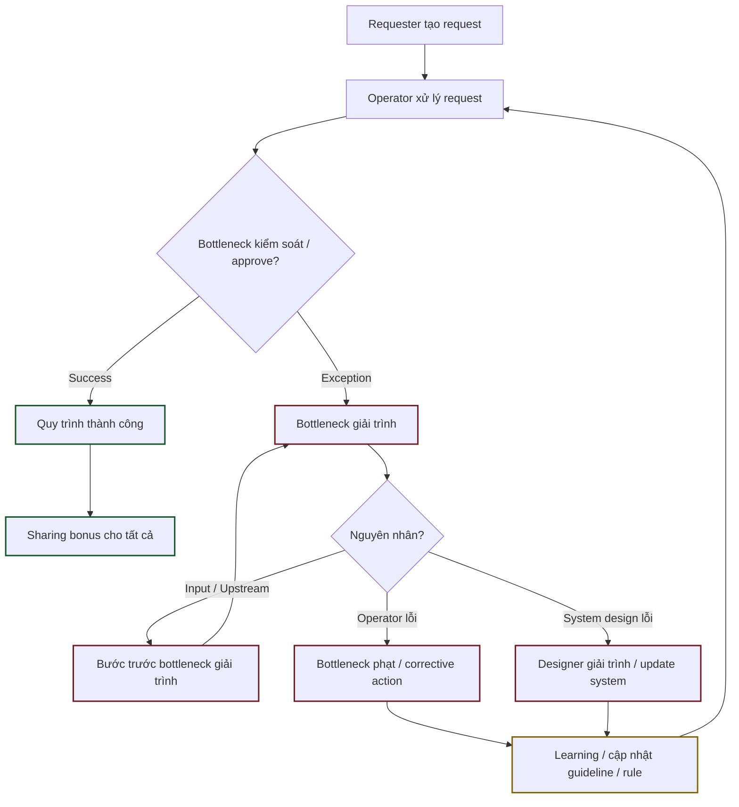

# Quy trình hướng trách nhiệm

```mermaid
flowchart TD
    %% Nodes
    A[Requester tạo request] --> B[Operator xử lý request]
    B --> C{Bottleneck kiểm soát / approve?}
    C -->|Success| D[Quy trình thành công]
    D --> E[Sharing bonus cho tất cả]
    
    C -->|Exception| F[Bottleneck giải trình]
    F --> G{Nguyên nhân?}
    
    G -->|Input / Upstream| H[Bước trước bottleneck giải trình]
    G -->|Operator lỗi| I[Bottleneck phạt / corrective action]
    G -->|System design lỗi| J[Designer giải trình / update system]
    
    H --> F
    I --> K[Learning / cập nhật guideline / rule]
    J --> K
    K --> B
    
    %% Notes
    classDef success fill:#green,stroke:#155724,stroke-width:2px;
    classDef exception fill:#red,stroke:#721c24,stroke-width:2px;
    classDef accountability fill:#yellow,stroke:#856404,stroke-width:2px;

    class D,E success
    class F,H,I,J exception
    class K accountability
```
