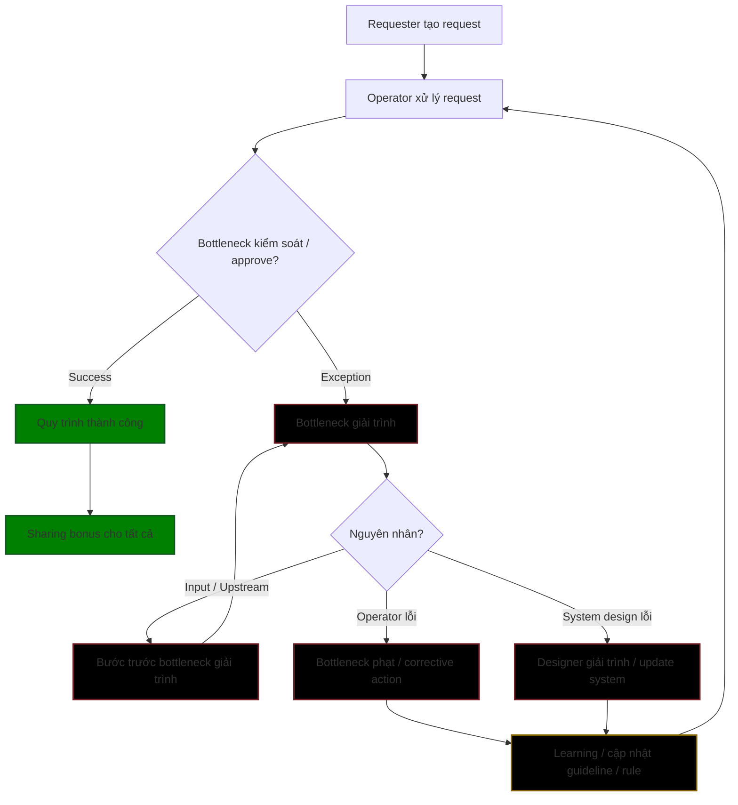

# Quy trình hướng trách nhiệm
* **Reward** → success
* **Accountability** → bottleneck + upstream + designer nếu cần
* **Learning** → cập nhật hệ thống để giảm lỗi lặp lại

### Giải thích workflow:

1. **Requester** tạo request → **Operator** xử lý
2. **Bottleneck** kiểm soát request:

   * Nếu **thành công** → tất cả nhận **sharing bonus**
   * Nếu **exception** → bottleneck **giải trình**
3. **Nguyên nhân exception**:

   * **Input / Upstream lỗi** → bước trước bottleneck phải giải trình
   * **Operator lỗi** → bottleneck phạt / corrective action
   * **System design lỗi** → designer giải trình, cập nhật system
4. **Learning / Feedback loop**:

   * Rule, guideline, template được cập nhật → quay lại operator xử lý request mới

---
## Áp dụng vào ChatOps, giúp:
* **Accountability rõ ràng** → leader (system designer) chịu trách nhiệm rule/template/compliance
* **Throughput cao** → junior/senior operator vận hành trực tiếp, AI giúp lọc & điều phối
* **Minh bạch + traceability** → mọi hành động, exception, giải trình đều có log trong chat

**Human, reward & accountability**,
* **Junior Operator**: làm các task tần suất cao, rule đơn giản → AI điều phối, chỉ log
* **Senior Operator**: làm task khó, AI gợi ý corrective action
* **Leader / System Designer**: approve exceptions lớn, cập nhật rule/template, quyết định compliance
* **AI**: routing → monitoring → gợi ý learning → ghi log → tính bonus

### 🧩 1. Vai trò trong ChatOps

| Vai trò                      | Mô tả                                                  | Quyền / Responsibility                                                                                      |
| ---------------------------- | ------------------------------------------------------ | ----------------------------------------------------------------------------------------------------------- |
| **Leader / System Designer** | Cập nhật rule, template, compliance; quyết định policy | - Chịu trách nhiệm cuối cùng cho rule/template   - Giải trình khi bottleneck fail liên quan đến thiết kế |
| **Senior Operator**          | Thực hiện task phức tạp, mentor junior                 | - Xử lý request theo rule   - Giải trình nếu xảy ra exception trong phạm vi họ kiểm soát                 |
| **Junior Operator**          | Thực hiện task đơn giản / tần suất cao                 | - Thực hiện theo hướng dẫn   - Không chịu phạt nếu tuân thủ rule                                         |
| **AI / Chatbot**             | Điều phối task, lọc request, gợi ý hành động           | - Xử lý rule-based routing   - Gợi ý corrective action   - Log, monitor exception                     |

### 🔄 2. Workflow ChatOps
1. **Requester gửi request vào group chat**
2. **AI agent**:
   * Phân loại request
   * Gửi đến operator phù hợp (junior/senior)
   * *Nếu cần approval* → gửi đến bottleneck (senior hoặc leader nếu rule phức tạp)
3. **Operator xử lý request** trong chat, AI agent ghi log mọi hành động
4. **Bottleneck / Leader**:
    * kiểm tra exception → giải trình → cập nhật rule/template (*nếu cần*)
6. **Sharing bonus / reward**: nếu task thành công → AI thông báo chia thưởng
7. **Learning loop**: AI theo dõi pattern, đề xuất cải tiến rule/template

### ⚡ 3. Ưu điểm của mô hình này
* **Throughput cao**:
    * AI giảm workload bottleneck
    * → operator tập trung vào task thực sự cần con người
* **Accountability rõ ràng**:
    * leader/ bottleneck chịu trách nhiệm rule/template
    * operator chỉ thực hiện
* **Traceability**:
    * mọi request, quyết định, exception được ghi trong chat
    * → dễ audit
* **Feedback real-time**:
    * AI gợi ý corrective action
    * → rút ngắn learning loop
* **Scalable**:
    * junior/senior tăng số lượng request mà không tăng bottleneck quá nhiều

### ⚠️ 4. Một vài điểm cần chú ý
1. **Bottleneck không bị overload**
   * Rule phức tạp → tất cả phải đi qua leader → chậm
   * Giải pháp: **multi-layer bottleneck** (senior first, leader chỉ approve edge-case)

2. **Quality của input / chat logs**
   * Operator phải follow template → AI mới tự động xử lý, gợi ý
   * Nếu input sai → bottleneck vẫn phải giải trình → tạo friction

3. **AI orchestration**
   * AI cần có:
       * routing, logging, exception detection, alerting
       *  gợi ý corrective action
   * Nếu AI yếu → **bottleneck sẽ lại quá tải**

4. **Incentive design**
   * Sharing bonus nên phản ánh cả **throughput + success rate + compliance**
   * **không chỉ success đơn thuần**

