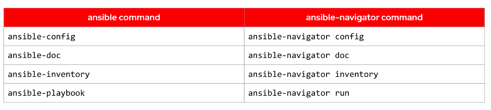
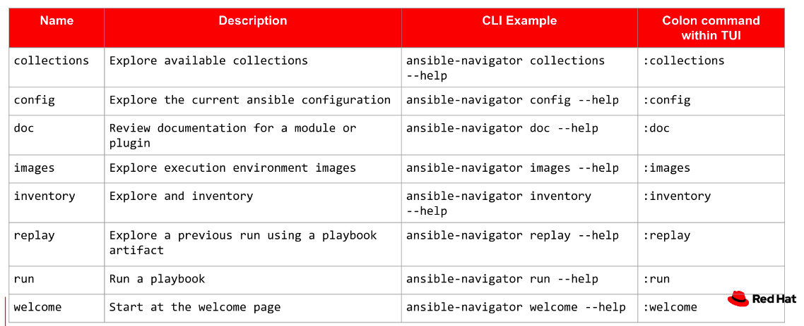

# In-depth ansible

## Hosts and Remote Users
- ### Using `all` to include all of the hosts in the inventory file
- ### Using `order` to sort the hosts in our inventory file in alphabetical order
- ### Using `reverse_sorted` in reverse alphabetical order
- ### Using `shuffle` in a random order
```yaml
---
- hosts: all
  order: sorted
```

## Remote user is the user which performs the tasks
- ### How to use other user
```yaml
---
- hosts: database
  remote_user: tom
  become: yes
  become_user: postgres
```
- ### How to use root user
```yaml
- hosts: database
  remote_user: tom
  become: yes
  become_user: root
```

## Notify
- ### allow our playbook to respond to changes which may be occurring in our environment
- ### set up a notify action at the end of a block of tasks that will only be triggered once
- ### need to set up a handler section after all the tasks for our playbook have been listed

## How to create a variable
```yaml
vars:
  mysql_root_password: password
```

## Ansible navigator


```bash
sudo python3 -m pip install ansible-navigator
```
- ### Command ``
```text
> ANSIBLE.BUILTIN.USER    (/usr/local/lib/python3.8/site-packages/ansible/modules/user.py)

        Manage user accounts and user attributes. For Windows targets, use the [ansible.windows.win_user] module
        instead.

OPTIONS (= is mandatory):

- append
        If `yes', add the user to the groups specified in `groups'.
        If `no', user will only be added to the groups specified in `groups', removing them from all other
        groups.
        [Default: False]
        type: bool
...
```

## Running playbooks `The most important colors of ansible`
- ### `Green`: A task execute as expected, no change was made
- ### `Yellow`: A task execute as expected, making a chane
- ### `Red`: A task failed to execute successfully

## Fix bugs
### `Error 1`: {"msg": "Missing sudo password"}
- ### Using command `-k` or `--ask-become-­pass (or) -k` to entering SSH password
```bash
ansible-playbook -i hosts demo-playbook.yml -kK
```
- ### Using command `-K` to entering BECOME password